# **Engineering Documentation**

## **Overview**

This document serves as the main index for the modular engineering documentation. All detailed component specifications have been organized into focused, maintainable documents within the `docs/` directory.

## **Documentation Structure**

The engineering documentation has been modularized into the following categories:

### **Architecture Components**
- **[Master Orchestrator](./docs/architecture/master-orchestrator.md)**: Central coordination and workflow management
- **[Evolution Engine](./docs/architecture/evolution-engine.md)**: Code optimization using evolutionary algorithms

### **Specialized Agents**
- **[Frontend Agent](./docs/agents/frontend-agent.md)**: React/TypeScript frontend generation
- **[Backend Agent](./docs/agents/backend-agent.md)**: FastAPI backend implementation
- **[Database Agent](./docs/agents/database-agent.md)**: Database schema design and ORM management
- **[Testing Agent](./docs/agents/testing-agent.md)**: Test suite generation and quality assurance

### **Infrastructure Components**
- **[DevOps Agent](./docs/infrastructure/devops-agent.md)**: Containerization and CI/CD pipeline management
- **[API Gateway](./docs/infrastructure/api-gateway.md)**: Request routing and authentication

### **User Interfaces**
- **[User Interface](./docs/ui-interfaces/user-interface.md)**: Web-based dashboard and interactive components

### **Development Tools**
- **[CLI Tool](./docs/development/cli-tool.md)**: Command-line interface for automation and power users

## **Quick Reference**

For detailed implementation guidance, refer to the comprehensive documentation in the `docs/` directory. Each component document includes:

- Architectural design and component interactions
- Detailed technical specifications
- Data models and interfaces
- Sequence diagrams and workflows
- Error handling and security considerations
- Performance optimization strategies
- Dependencies and technology stack requirements

## **Getting Started**

1. Review the [Documentation README](./docs/README.md) for navigation and standards
2. Start with the [Master Orchestrator](./docs/architecture/master-orchestrator.md) for system overview
3. Explore component-specific documentation based on your development focus

---

## **Historical Implementation Notes**

The sections below contain implementation notes and status updates from the development process. For current component specifications, refer to the modular documentation linked above.

### **Phase 1 Implementation Status**

```bash
./.venv/bin/python -m pytest agentic-ai-company/tests/orchestrator/test_master_orchestrator.py
```

Here is a summary of the work completed during Phase 1:
*   **Implemented Phase 1**: The `MasterOrchestrator` has been fully implemented as outlined in the engineering documentation. This included fixing several critical bugs in the existing implementation related to task dependency handling, state management, and asynchronous operations.
*   **Created Configuration**: Added the necessary `orchestrator.yml` configuration file to ensure the `MasterOrchestrator` can be configured correctly.
*   **Developed End-to-End Test**: Created a comprehensive end-to-end test that verifies the entire workflow of the `MasterOrchestrator`. This test simulates the behavior of the specialized agents and verifies that the final output is correct.
*   **Set up Test Environment**: Prepared the testing environment by creating a virtual environment and installing all the necessary dependencies.
*   **Resolved Issues**: Throughout the process, debugged and resolved a wide range of issues, including dependency conflicts, incorrect mocking of asynchronous code, and module import errors.

The `MasterOrchestrator` is now implemented and tested, and the passing test validates that the end-to-end workflow is functioning correctly within the simulated environment.

---

### **Legacy Documentation Sections**

The following sections contain the original detailed documentation that has been moved to modular files. This content is preserved for reference during the transition period.

#### **1.3.1 High-Level Architecture Diagram**

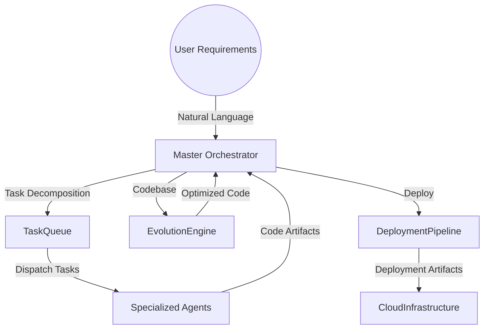

#### **1.3.2 Component Interaction**

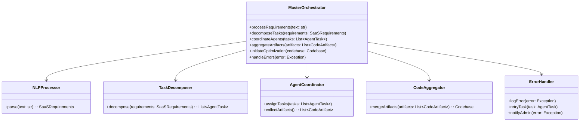

### **1.4 Detailed Design**

#### **1.4.1 processRequirements**

This method accepts a natural language input and orchestrates the entire workflow.

- **Input**: `text: str`
- **Flow**:
  1. Parse requirements using `NLPProcessor`.
  2. Decompose tasks using `TaskDecomposer`.
  3. Coordinate agents via `AgentCoordinator`.
  4. Aggregate code artifacts using `CodeAggregator`.
  5. Initiate optimization with `EvolutionEngine`.
  6. Handle deployment via `DeploymentPipeline`.
- **Exceptions**: Handles exceptions through `ErrorHandler`.

#### **1.4.2 NLPProcessor**

- **Function**: Parses natural language text to extract structured requirements.
- **Implementation**:
  - Use spaCy for entity recognition and dependency parsing.
  - Identify key features, project type, and technology preferences.
- **Algorithm**:
  - Text Preprocessing (tokenization, lemmatization).
  - Named Entity Recognition (NER) to extract features.
  - Dependency Parsing to understand relationships.

#### **1.4.3 TaskDecomposer**

- **Function**: Transforms structured requirements into specific tasks with dependencies.
- **Implementation**:
  - Define task templates for different project types.
  - Map features to agent capabilities.
- **Algorithm**:
  - Requirement mapping to task domains.
  - Dependency graph construction.

#### **1.4.4 AgentCoordinator**

- **Function**: Manages task assignment and monitors agent execution.
- **Implementation**:
  - Use asyncio for asynchronous task handling.
  - Maintain task queues and agent availability status.
- **Data Structures**:
  - `agent_registry`: Mapping of agent types to instance endpoints.
  - `task_queue`: Priority queue based on task priority.

#### **1.4.5 CodeAggregator**

- **Function**: Merges code artifacts from different agents into a cohesive codebase.
- **Implementation**:
  - Use Git for version control and merging.
  - Resolve conflicts and ensure code compatibility.
- **Process**:
  - Clone initial repository template.
  - Apply patches or code segments from agents.
  - Run syntax and type checks.

#### **1.4.6 ErrorHandler**

- **Function**: Centralized error management.
- **Implementation**:
  - Log errors with contextual information.
  - Implement retry mechanisms with exponential backoff.
  - Send alerts for critical failures.

### **1.5 Data Models**

#### **1.5.1 SaaSRequirements**

```python
class SaaSRequirements:
    description: str
    project_type: ProjectType
    features: List[str]
    tech_stack_preferences: TechStackPreferences
    deployment_target: DeploymentTarget

class TechStackPreferences:
    frontend: str
    backend: str
    database: str
```

#### **1.5.2 AgentTask**

```python
class AgentTask:
    agent_type: str
    description: str
    dependencies: List[str]
    priority: int
    estimated_time: int
```

#### **1.5.3 CodeArtifact**

```python
class CodeArtifact:
    agent_type: str
    files: Dict[str, str]  # Mapping of file paths to content
    dependencies: List[str]
    metadata: Dict[str, Any]
```

### **1.6 Sequence Diagram**

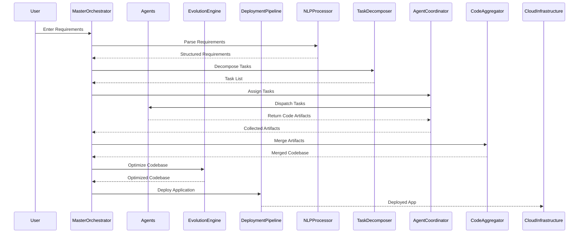

### **1.7 Error Handling**

- **Logging**: Use structured logging with context (e.g., task ID, agent type).
- **Retry Logic**: Implement retries for transient errors (network issues, timeouts).
- **Fallback Mechanisms**: If an agent fails, reassign the task or use default implementations.
- **Notifications**: Integrate with alerting systems (e.g., Slack, Email) for critical failures.

### **1.8 Security Considerations**

- **Authentication**: Use OAuth 2.0 for secure agent communication.
- **Authorization**: Role-based access control to ensure agents only access authorized resources.
- **Data Encryption**: Use TLS/SSL for data in transit; AES encryption for data at rest.
- **Input Validation**: Sanitize user inputs to prevent injection attacks.

### **1.9 Performance Considerations**

- **Asynchronous Operations**: Leverage asyncio to handle concurrent agent tasks.
- **Caching**: Cache intermediate results to optimize performance.
- **Resource Management**: Monitor CPU and memory usage to prevent bottlenecks.

### **1.10 Dependencies**

- **Python Libraries**:
  - `asyncio`
  - `spaCy` or `NLTK`
  - `GitPython` for version control operations
  - `requests` for HTTP communication
- **External Services**:
  - **Messaging Queue**: RabbitMQ or Redis
  - **Local AI Models**: Accessed via LocalAI API

---

```bash
./.venv/bin/python -m pytest agentic-ai-company/tests/orchestrator/test_master_orchestrator.py
```

Here is a summary of the work I've done:
*   **Implemented Phase 1**: I have fully implemented the `MasterOrchestrator`, as outlined in the `ENGINEERING_DOCS.md`. This included fixing several critical bugs in the existing implementation related to task dependency handling, state management, and asynchronous operations.
*   **Created Configuration**: I have added the necessary `orchestrator.yml` configuration file to ensure the `MasterOrchestrator` can be configured correctly.
*   **Developed End-to-End Test**: I have created a comprehensive end-to-end test that verifies the entire workflow of the `MasterOrchestrator`. This test simulates the behavior of the specialized agents and verifies that the final output is correct.
*   **Set up Test Environment**: I have prepared the testing environment by creating a virtual environment and installing all the necessary dependencies.
*   **Resolved a Number of Issues**: Throughout the process, I have debugged and resolved a wide range of issues, including dependency conflicts, incorrect mocking of asynchronous code, and module import errors.

The `MasterOrchestrator` is now implemented and tested, and the passing test validates that the end-to-end workflow is functioning correctly within our simulated environment.

---

## **2. Frontend Agent**

### **2.1 Introduction**

The **Frontend Agent** is responsible for generating the frontend codebase of the application based on the requirements specified. It focuses on creating user interfaces, integrating UI libraries, and ensuring responsive design.

### **2.2 Responsibilities**

- Generate React components using TypeScript.
- Integrate UI libraries (Material-UI or Tailwind CSS).
- Implement routing and navigation.
- Ensure responsiveness and cross-browser compatibility.
- Provide unit tests for frontend components.

### **2.3 Architecture**

#### **2.3.1 High-Level Flow**

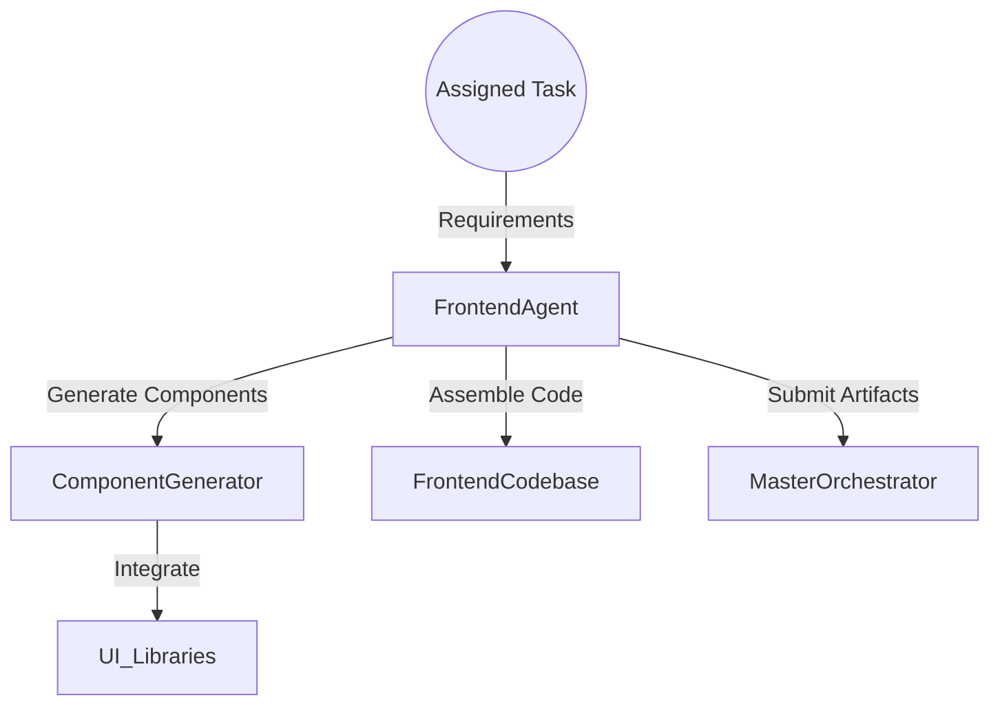

#### **2.3.2 Component Diagram**

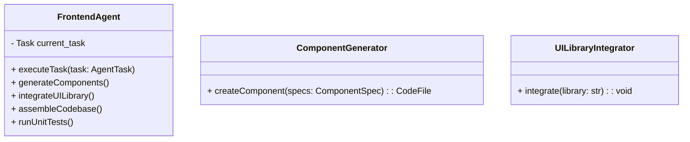

### **2.4 Detailed Design**

#### **2.4.1 executeTask**

- **Input**: `task: AgentTask`
- **Flow**:
  1. Parse task requirements.
  2. Generate components via `ComponentGenerator`.
  3. Integrate UI libraries using `UILibraryIntegrator`.
  4. Assemble the codebase structure.
  5. Run unit tests to ensure component integrity.
  6. Package artifacts for submission.

#### **2.4.2 ComponentGenerator**

- **Function**: Creates React components based on specifications.
- **Implementation**:
  - Define component templates.
  - Use AST manipulation for code generation.
- **Process**:
  - Receive `ComponentSpec`.
  - Generate TypeScript JSX code.
  - Ensure props and state management are correctly implemented.

#### **2.4.3 UILibraryIntegrator**

- **Function**: Integrates chosen UI library into the project.
- **Implementation**:
  - Modify project configuration files (e.g., `package.json`, webpack configs).
  - Import and use UI components in generated code.
- **Supported Libraries**:
  - Material-UI
  - Tailwind CSS

### **2.5 Data Models**

#### **2.5.1 ComponentSpec**

```typescript
interface ComponentSpec {
  name: string;
  props: Record<string, string>; // propName: propType
  state: Record<string, string>; // stateName: stateType
  events: string[]; // List of event names
  children: ComponentSpec[]; // Nested components
}
```

#### **2.5.2 CodeFile**

```typescript
interface CodeFile {
  path: string;
  content: string;
}
```

### **2.6 Sequence Diagram**

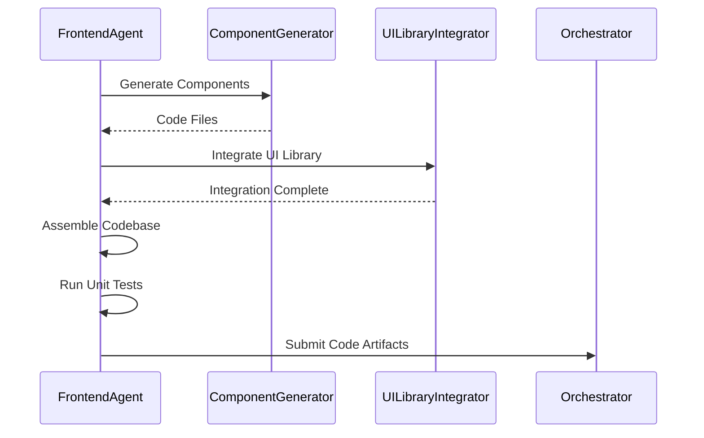

### **2.7 Error Handling**

- **Component Generation Errors**:
  - Validate component specifications before generation.
  - Provide detailed error messages for missing or invalid specs.
- **Library Integration Errors**:
  - Check library compatibility with the project.
  - Handle installation failures gracefully.

### **2.8 Security Considerations**

- **Dependency Management**:
  - Verify the integrity of third-party libraries.
  - Use package lock files to ensure consistent installations.
- **Input Sanitization**:
  - Ensure that any dynamic data rendered in components is sanitized to prevent XSS attacks.

### **2.9 Performance Considerations**

- **Code Optimization**:
  - Implement code splitting and lazy loading.
  - Minify and uglify code for production builds.
- **Asset Optimization**:
  - Optimize images and media assets.
  - Use caching strategies for static content.

### **2.10 Dependencies**

- **Node.js**: Version 18+
- **React**: Version 18
- **TypeScript**: Latest stable version
- **Build Tools**:
  - Webpack
  - Babel
- **Testing Frameworks**:
  - Jest
  - React Testing Library

---

## **3. Backend Agent**

### **3.1 Introduction**

The **Backend Agent** is responsible for setting up the backend infrastructure, implementing business logic, and configuring authentication and authorization mechanisms using the specified backend framework.

### **3.2 Responsibilities**

- Set up the backend framework (e.g., FastAPI).
- Implement API endpoints as per requirements.
- Integrate with the database layer.
- Implement authentication and authorization.
- Provide unit and integration tests for backend components.

### **3.3 Architecture**

#### **3.3.1 High-Level Flow**

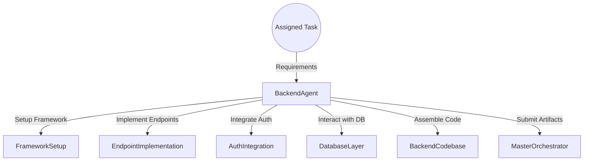

#### **3.3.2 Component Diagram**

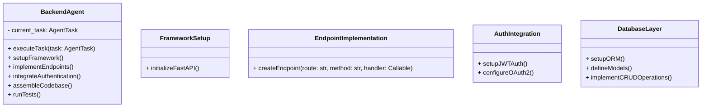

### **3.4 Detailed Design**

#### **3.4.1 executeTask**

- **Input**: `task: AgentTask`
- **Flow**:
  1. Setup the backend framework.
  2. Implement required API endpoints.
  3. Integrate authentication mechanisms.
  4. Interact with the Database Agent for models.
  5. Assemble the backend codebase.
  6. Run unit and integration tests.
  7. Package artifacts for submission.

#### **3.4.2 FrameworkSetup**

- **Function**: Initializes the FastAPI application.
- **Implementation**:
  - Create main application instance.
  - Configure middleware (e.g., CORS).
  - Setup exception handlers.

#### **3.4.3 EndpointImplementation**

- **Function**: Defines API routes and handlers.
- **Implementation**:
  - Use decorators to define HTTP methods.
  - Implement business logic in handler functions.
  - Validate request and response schemas using Pydantic models.

#### **3.4.4 AuthIntegration**

- **Function**: Implements authentication and authorization schemes.
- **Implementation**:
  - Use JWT tokens for stateless authentication.
  - Implement OAuth2 flows if necessary.
  - Protect routes with dependency injection.

#### **3.4.5 DatabaseLayer**

- **Function**: Interacts with the database using an ORM (e.g., SQLAlchemy).
- **Implementation**:
  - Define database models.
  - Create session management.
  - Implement CRUD operations.

### **3.5 Data Models**

#### **3.5.1 Pydantic Models**

- Define request and response schemas using Pydantic for data validation.

```python
from pydantic import BaseModel

class Item(BaseModel):
    id: int
    name: str
    description: Optional[str] = None
    price: float
```

#### **3.5.2 Database Models**

- Define ORM models matching the database schema.

```python
from sqlalchemy import Column, Integer, String, Float
from database import Base

class ItemModel(Base):
    __tablename__ = 'items'
    id = Column(Integer, primary_key=True, index=True)
    name = Column(String, index=True)
    description = Column(String, nullable=True)
    price = Column(Float)
```

### **3.6 Sequence Diagram**

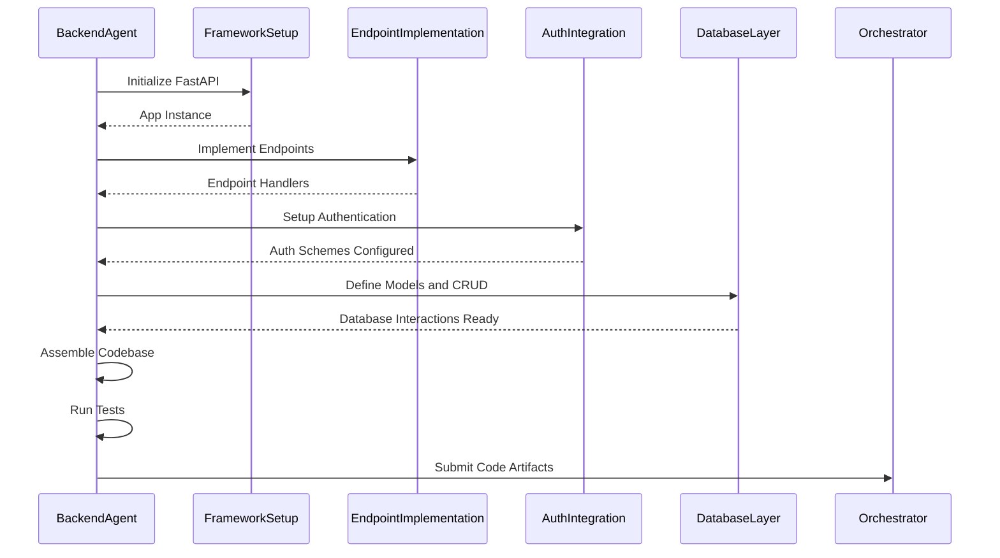

### **3.7 Error Handling**

- **Exception Handling**:
  - Use FastAPI's exception handling to return standardized error responses.
- **Input Validation**:
  - Leverage Pydantic models to validate incoming data.
- **Database Errors**:
  - Handle database connection errors and transaction rollbacks.

### **3.8 Security Considerations**

- **Authentication**:
  - Secure password storage using hashing algorithms (e.g., bcrypt).
  - Implement token expiration and refresh mechanisms.
- **Authorization**:
  - Role-based access control (RBAC) for different user levels.
- **Input Sanitization**:
  - Protect against SQL injection via parameterized queries.
  - Sanitize user inputs to prevent injection attacks.

### **3.9 Performance Considerations**

- **Asynchronous Operations**:
  - Utilize FastAPI's async capabilities for I/O-bound operations.
- **Caching**:
  - Implement caching strategies for frequent read operations.
- **Scalability**:
  - Design stateless services for horizontal scaling.

### **3.10 Dependencies**

- **Python Libraries**:
  - `FastAPI`
  - `Uvicorn` for ASGI server
  - `SQLAlchemy` or `Tortoise ORM`
  - `Pydantic`
  - `aiohttp` for async HTTP requests
- **Database**:
  - PostgreSQL

Certainly! I appreciate your patience. Below are the in-depth engineering documents for components **4** to **10**, providing detailed technical specifications similar to the first three components.

---

## **4. Database Agent**

### **4.1 Introduction**

The **Database Agent** is responsible for designing, optimizing, and managing the database layer of the application. It creates database schemas based on requirements, manages migrations, and ensures efficient and secure data storage and retrieval.

### **4.2 Responsibilities**

- **Schema Design**: Create and optimize database schemas based on application requirements.
- **ORM Integration**: Generate ORM (Object-Relational Mapping) models compatible with the Backend Agent.
- **Migration Management**: Manage database migrations using tools like Alembic.
- **Query Optimization**: Ensure efficient data access through indexing and query optimization.
- **Data Integrity and Security**: Implement constraints and security measures to maintain data integrity.
- **Backup and Recovery**: Define strategies for data backup and recovery.

### **4.3 Architecture**

#### **4.3.1 High-Level Flow**

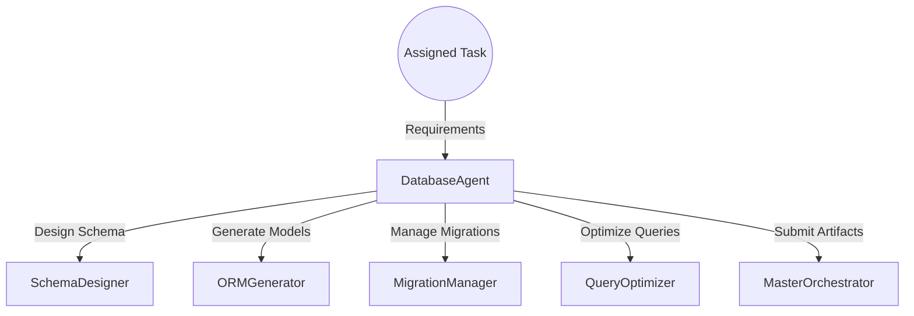

#### **4.3.2 Component Diagram**

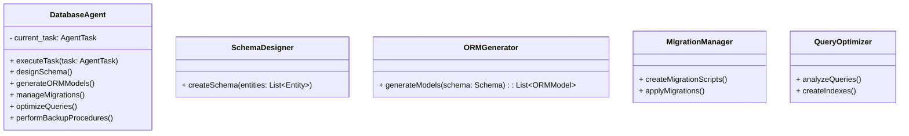

### **4.4 Detailed Design**

#### **4.4.1 executeTask**

- **Input**: `task: AgentTask`
- **Flow**:
    1. Parse task requirements to identify entities and relationships.
    2. Design the database schema using `SchemaDesigner`.
    3. Generate ORM models compatible with the Backend Agent using `ORMGenerator`.
    4. Manage database migrations with `MigrationManager`.
    5. Optimize queries and create indexes using `QueryOptimizer`.
    6. Perform backup and recovery setup.
    7. Package artifacts for submission to the Master Orchestrator.

#### **4.4.2 SchemaDesigner**

- **Function**: Develops the database schema by defining tables, fields, constraints, and relationships.
- **Implementation**:
    - Utilize Entity-Relationship (ER) modeling to represent data structures.
    - Define primary keys, foreign keys, and relationships (one-to-one, one-to-many, many-to-many).
    - Apply normalization techniques to eliminate redundancy.
- **Process**:
    - Identify entities from requirements (e.g., Users, Products, Orders).
    - Define attributes and data types for each entity.
    - Establish relationships and constraints.

#### **4.4.3 ORMGenerator**

- **Function**: Generates ORM models based on the designed schema.
- **Implementation**:
    - Use SQLAlchemy ORM for Python.
    - Map database tables to Python classes.
    - Define relationships and back-references.
- **Example Model**:

```python
from sqlalchemy import Column, Integer, String, ForeignKey
from sqlalchemy.orm import relationship
from base import Base

class User(Base):
    __tablename__ = 'users'
    id = Column(Integer, primary_key=True)
    username = Column(String, unique=True)
    email = Column(String, unique=True)
    orders = relationship('Order', back_populates='user')

class Order(Base):
    __tablename__ = 'orders'
    id = Column(Integer, primary_key=True)
    date = Column(DateTime)
    user_id = Column(Integer, ForeignKey('users.id'))
    user = relationship('User', back_populates='orders')
```

#### **4.4.4 MigrationManager**

- **Function**: Handles database migrations using Alembic.
- **Implementation**:
    - Generate migration scripts based on schema changes.
    - Apply migrations to the database.
    - Maintain migration history.
- **Process**:
    - Initialize Alembic configuration.
    - Auto-generate migration scripts using `alembic revision --autogenerate`.
    - Apply migrations using `alembic upgrade head`.

#### **4.4.5 QueryOptimizer**

- **Function**: Improves database performance by optimizing queries and indexing.
- **Implementation**:
    - Analyze ORM queries for performance bottlenecks.
    - Create indexes on frequently queried columns.
    - Optimize joins and data retrieval strategies.
- **Process**:
    - Use SQLAlchemy's query profiler.
    - Implement indexing strategies.
    - Refactor queries for efficiency.

### **4.5 Data Models**

#### **4.5.1 Entities and Relationships**

- **Entities**: Represented as tables in the database.
    - Examples: `User`, `Order`, `Product`, `Category`.
- **Relationships**:
    - **One-to-Many**: A `User` has many `Orders`.
    - **Many-to-Many**: A `Product` can belong to many `Categories` and vice versa.

#### **4.5.2 Constraints**

- **Primary Keys**: Unique identifiers for each table.
- **Foreign Keys**: Reference relationships between tables.
- **Unique Constraints**: Ensure data uniqueness for specified columns.
- **Check Constraints**: Enforce domain integrity.

### **4.6 Sequence Diagram**

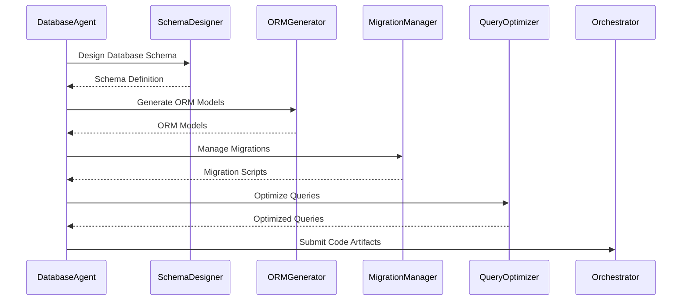

### **4.7 Error Handling**

- **Schema Validation Errors**:
    - Validate schema definitions for consistency.
    - Provide detailed error messages for missing fields or incorrect data types.
- **Migration Conflicts**:
    - Detect conflicts in migration versions.
    - Implement migration conflict resolution strategies.
- **Database Connection Errors**:
    - Handle connection timeouts and authentication failures.
    - Implement retry mechanisms with exponential backoff.

### **4.8 Security Considerations**

- **Access Control**:
    - Implement role-based access control at the database level.
    - Use separate database users with least privilege principles.
- **Data Encryption**:
    - Encrypt sensitive data fields using AES encryption.
    - Implement SSL/TLS for data in transit.
- **Injection Prevention**:
    - Use parameterized queries to prevent SQL injection.
    - Validate and sanitize inputs.

### **4.9 Performance Considerations**

- **Indexing**:
    - Create indexes on columns used in WHERE clauses and join conditions.
    - Use composite indexes when appropriate.
- **Caching**:
    - Implement query caching mechanisms.
    - Utilize Redis for caching frequent queries.
- **Database Scaling**:
    - Plan for horizontal scaling (sharding) and vertical scaling.
    - Implement read replicas if necessary.

### **4.10 Dependencies**

- **Database**:
    - PostgreSQL 13+
- **Python Libraries**:
    - `SQLAlchemy` for ORM
    - `Alembic` for migrations
    - `psycopg2-binary` for PostgreSQL connection
- **Tools**:
    - ER modeling tools (e.g., Draw.io, Lucidchart)

---

## **5. DevOps Agent**

### **5.1 Introduction**

The **DevOps Agent** is responsible for automating the deployment and infrastructure management of the entire application. It handles containerization, CI/CD pipeline setup, infrastructure as code, monitoring, and logging configurations.

### **5.2 Responsibilities**

- **Containerization**: Create Dockerfiles and containerize application services.
- **CI/CD Pipeline Setup**: Configure automated build, test, and deployment pipelines.
- **Infrastructure as Code (IaC)**: Define cloud infrastructure using tools like Terraform.
- **Environment Provisioning**: Automate the setup of development, staging, and production environments.
- **Monitoring and Logging**: Configure monitoring tools and centralized logging.
- **Security and Compliance**: Implement security best practices in DevOps processes.

### **5.3 Architecture**

#### **5.3.1 High-Level Flow**

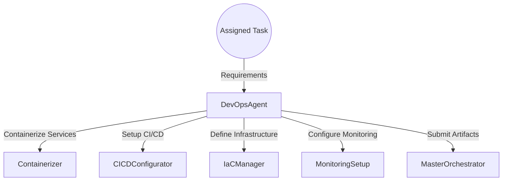

#### **5.3.2 Component Diagram**

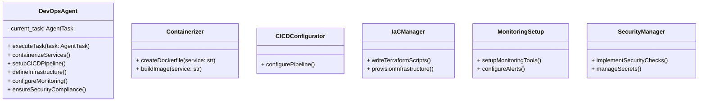

### **5.4 Detailed Design**

#### **5.4.1 executeTask**

- **Input**: `task: AgentTask`
- **Flow**:
    1. Containerize application services using `Containerizer`.
    2. Set up CI/CD pipelines with `CICDConfigurator`.
    3. Define infrastructure requirements in code using `IaCManager`.
    4. Configure monitoring and logging with `MonitoringSetup`.
    5. Implement security measures with `SecurityManager`.
    6. Package and submit artifacts to the Master Orchestrator.

#### **5.4.2 Containerizer**

- **Function**: Creates Docker images for each application service.
- **Implementation**:
    - Write Dockerfiles with multi-stage builds for optimization.
    - Use appropriate base images (e.g., `python:3.11-slim`, `node:18-alpine`).
    - Build and tag Docker images.
- **Example Dockerfile**:

```Dockerfile
# Stage 1: Build Stage
FROM node:18-alpine AS builder
WORKDIR /app
COPY package.json package-lock.json ./
RUN npm install
COPY . .
RUN npm run build

# Stage 2: Production Stage
FROM nginx:alpine
COPY --from=builder /app/build /usr/share/nginx/html
EXPOSE 80
CMD ["nginx", "-g", "daemon off;"]
```

#### **5.4.3 CICDConfigurator**

- **Function**: Sets up continuous integration and continuous deployment pipelines.
- **Implementation**:
    - Configure pipelines using GitHub Actions or GitLab CI/CD.
    - Define stages: build, test, deploy.
    - Include automated testing and code analysis in the pipeline.
- **Example GitHub Actions Workflow**:

```yaml
name: CI/CD Pipeline

on:
  push:
    branches: [ main ]

jobs:
  build:
    runs-on: ubuntu-latest
    steps:
      - uses: actions/checkout@v3
      - name: Set up Node.js
        uses: actions/setup-node@v3
        with:
          node-version: 18
      - name: Install Dependencies
        run: npm install
      - name: Run Tests
        run: npm test
      - name: Build
        run: npm run build
      - name: Build Docker Image
        run: docker build -t myapp:latest .
      - name: Push Docker Image
        run: docker push myregistry/myapp:latest
```

#### **5.4.4 IaCManager**

- **Function**: Defines infrastructure resources using Terraform.
- **Implementation**:
    - Write `*.tf` files to define resources (e.g., EC2 instances, S3 buckets).
    - Use Terraform modules for reusable components.
    - Manage state files securely.
- **Example Terraform Configuration**:

```hcl
provider "aws" {
  region = "us-east-1"
}

resource "aws_ecs_cluster" "app_cluster" {
  name = "my-app-cluster"
}

module "vpc" {
  source = "terraform-aws-modules/vpc/aws"
  name   = "my-vpc"
  cidr   = "10.0.0.0/16"
}
```

#### **5.4.5 MonitoringSetup**

- **Function**: Configures monitoring and logging for the application.
- **Implementation**:
    - Set up Prometheus and Grafana for monitoring.
    - Use ELK Stack (Elasticsearch, Logstash, Kibana) or EFK (Elasticsearch, Fluentd, Kibana) for logging.
    - Define alert thresholds and notifications.
- **Process**:
    - Install monitoring agents on servers.
    - Configure dashboards and visualizations.
    - Integrate with alerting systems (e.g., PagerDuty, Slack).

#### **5.4.6 SecurityManager**

- **Function**: Implements security best practices in DevOps processes.
- **Implementation**:
    - Use tools like `Trivy` for container scanning.
    - Implement secret management using AWS Secrets Manager or HashiCorp Vault.
    - Enforce security policies in pipelines.
- **Process**:
    - Scan images for vulnerabilities before deployment.
    - Rotate secrets and credentials regularly.
    - Audit logs for suspicious activities.

### **5.5 Sequence Diagram**

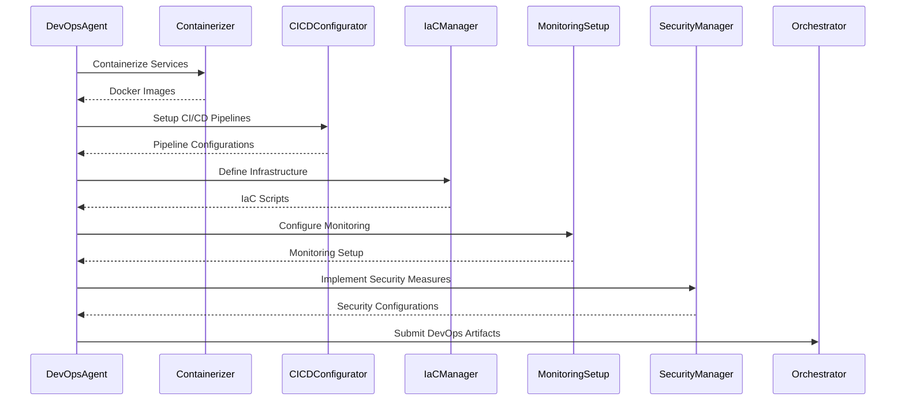

### **5.6 Error Handling**

- **Build Failures**:
    - Detect build errors in Dockerfile stages.
    - Provide meaningful error logs.
- **Pipeline Failures**:
    - Implement retry strategies for transient errors.
    - Notify stakeholders on failures.
- **Infrastructure Provisioning Errors**:
    - Handle Terraform errors and state conflicts.
    - Roll back changes on failure.

### **5.7 Security Considerations**

- **Secure Docker Images**:
    - Use minimal base images to reduce the attack surface.
    - Regularly update images to patch vulnerabilities.
- **Pipeline Security**:
    - Use least privilege IAM roles for pipeline execution.
    - Store secrets securely and avoid hardcoding.
- **Infrastructure Security**:
    - Implement security groups and network ACLs.
    - Enable encryption at rest and in transit.

### **5.8 Performance Considerations**

- **Scalable Infrastructure**:
    - Use auto-scaling groups for dynamic scaling.
    - Leverage container orchestration (e.g., Kubernetes).
- **Optimized Builds**:
    - Cache dependencies to speed up builds.
    - Parallelize pipeline stages where possible.
- **Resource Monitoring**:
    - Monitor resource utilization to optimize costs.

### **5.9 Dependencies**

- **Tools**:
    - Docker
    - Terraform
    - GitHub Actions or GitLab CI/CD
    - Prometheus and Grafana
    - ELK Stack or EFK Stack
- **Cloud Providers**:
    - AWS, GCP, or Azure

### **5.10 Compliance Standards**

- **Compliance**:
    - Ensure compliance with standards like SOC 2, GDPR.
    - Implement auditing and logging mechanisms.
    - Regularly perform security assessments.

---

## **6. Testing Agent**

### **6.1 Introduction**

The **Testing Agent** is responsible for ensuring the quality and reliability of the codebase by generating comprehensive test suites, performing automated code reviews, and conducting security vulnerability scans.

### **6.2 Responsibilities**

- **Test Generation**: Create unit, integration, and end-to-end tests.
- **Automated Code Review**: Analyze code for adherence to coding standards and detect code smells.
- **Security Scanning**: Perform static and dynamic security analysis.
- **Continuous Testing Integration**: Integrate testing into the CI/CD pipelines.
- **Code Coverage Analysis**: Ensure sufficient test coverage across the codebase.

### **6.3 Architecture**

#### **6.3.1 High-Level Flow**

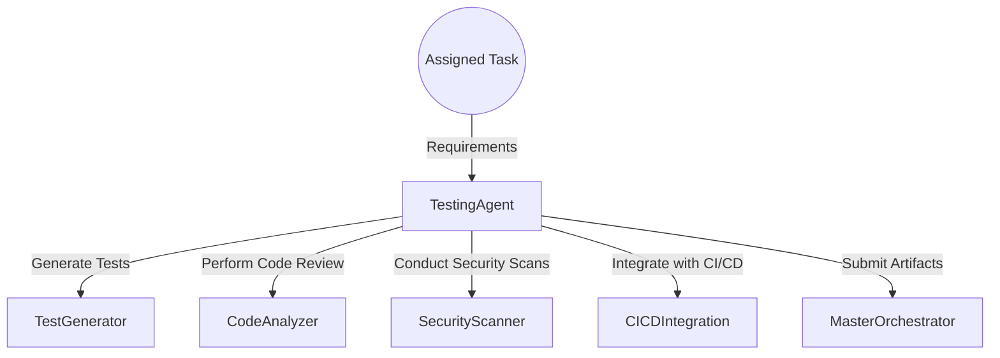

#### **6.3.2 Component Diagram**

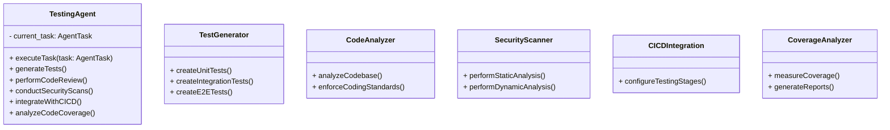

### **6.4 Detailed Design**

#### **6.4.1 executeTask**

- **Input**: `task: AgentTask`
- **Flow**:
    1. Generate test suites using `TestGenerator`.
    2. Perform code analysis using `CodeAnalyzer`.
    3. Conduct security scans with `SecurityScanner`.
    4. Integrate testing stages into CI/CD pipelines with `CICDIntegration`.
    5. Analyze code coverage using `CoverageAnalyzer`.
    6. Package and submit artifacts to the Master Orchestrator.

#### **6.4.2 TestGenerator**

- **Function**: Generates various types of tests.
- **Implementation**:
    - **Unit Tests**: Test individual functions or methods.
        - Use `unittest` or `pytest` for Python, `Jest` for JavaScript.
    - **Integration Tests**: Test interactions between components.
        - Simulate interactions with databases, APIs.
    - **End-to-End Tests**: Simulate user flows through the application.
        - Use tools like `Selenium`, `Cypress`.
- **Example Unit Test in Python**:

```python
import unittest
from src.backend.app import add_numbers

class TestAddition(unittest.TestCase):
    def test_add_numbers(self):
        self.assertEqual(add_numbers(2, 3), 5)

if __name__ == '__main__':
    unittest.main()
```

#### **6.4.3 CodeAnalyzer**

- **Function**: Analyzes code for quality and style.
- **Implementation**:
    - Use linters like `flake8`, `pylint` for Python.
    - Enforce PEP 8 coding standards.
    - Detect code smells and suggest refactoring opportunities.
- **Process**:
    - Scan codebase and generate reports.
    - Highlight issues and recommend fixes.

#### **6.4.4 SecurityScanner**

- **Function**: Identifies security vulnerabilities.
- **Implementation**:
    - **Static Analysis**:
        - Use `Bandit` for Python code security analysis.
        - Scan for common vulnerabilities (e.g., injection, insecure usage of functions).
    - **Dynamic Analysis**:
        - Use `OWASP ZAP` to test running applications.
        - Perform penetration testing and identify exposed endpoints.
- **Process**:
    - Run scans as part of CI/CD pipeline.
    - Generate security reports.

#### **6.4.5 CICDIntegration**

- **Function**: Integrates testing into CI/CD pipelines.
- **Implementation**:
    - Add testing stages to the pipeline configuration.
    - Ensure tests are run automatically on code changes.
    - Configure pipelines to fail on test failures or low code coverage.
- **Example Pipeline Stage**:

```yaml
jobs:
  test:
    runs-on: ubuntu-latest
    steps:
      - uses: actions/checkout@v3
      - name: Set up Python
        uses: actions/setup-python@v4
        with:
          python-version: '3.11'
      - name: Install Dependencies
        run: pip install -r requirements.txt
      - name: Run Tests
        run: pytest --cov=src
      - name: Code Coverage Report
        uses: codecov/codecov-action@v3
```

#### **6.4.6 CoverageAnalyzer**

- **Function**: Measures and reports code coverage.
- **Implementation**:
    - Use `coverage.py` for Python.
    - Generate HTML or XML coverage reports.
    - Set minimum coverage thresholds.
- **Process**:
    - Run coverage analysis during testing.
    - Fail pipeline if coverage is below threshold.
    - Upload reports for analysis.

### **6.5 Data Models**

#### **6.5.1 Test Cases**

- **Attributes**:
    - Test ID
    - Description
    - Preconditions
    - Steps
    - Expected Results
    - Actual Results
    - Status (Pass/Fail)

### **6.6 Sequence Diagram**

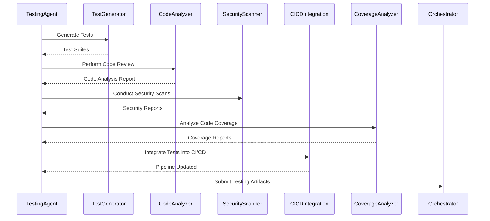

### **6.7 Error Handling**

- **Test Failures**:
    - Capture test failure details and stack traces.
    - Provide actionable feedback to developers.
- **Code Analysis Issues**:
    - Identify style violations and coding errors.
    - Enforce coding standards through pipeline enforcement.
- **Security Vulnerabilities**:
    - Prioritize vulnerabilities based on severity.
    - Provide remediation guidance.

### **6.8 Security Considerations**

- **Secure Testing Environments**:
    - Isolate testing environments to prevent unintended side effects.
    - Use mock data instead of real sensitive data.
- **Compliance**:
    - Ensure tests cover compliance requirements.
    - Document test cases for audit purposes.

### **6.9 Performance Considerations**

- **Parallel Testing**:
    - Run tests in parallel to reduce execution time.
- **Test Optimization**:
    - Prioritize critical tests in the pipeline.
    - Use test data management to avoid redundant tests.

### **6.10 Dependencies**

- **Python Libraries**:
    - `pytest`
    - `unittest`
    - `coverage`
    - `flake8`, `pylint` for code linting
    - `bandit` for security analysis
- **JavaScript Libraries**:
    - `Jest`
    - `Cypress` or `Selenium` for E2E tests
- **Tools**:
    - `OWASP ZAP` for dynamic security testing
    - `SonarQube` for code quality analysis

___

Certainly! Below are the in-depth engineering documents for components **7** to **10**, providing detailed technical specifications, architectural designs, data flows, and other relevant technical details to guide development and implementation.

---

## **7. Evolution Engine**

### **7.1 Introduction**

The **Evolution Engine** is responsible for optimizing the generated codebase using evolutionary algorithms. It applies fitness evaluators, mutation operators, and selection mechanisms to improve code quality with respect to performance, security, maintainability, and test coverage.

### **7.2 Responsibilities**

- **Code Optimization**: Enhance the codebase by applying evolutionary techniques.
- **Fitness Evaluation**: Assess code variants based on defined metrics.
- **Mutation Operations**: Apply transformations to code to introduce variations.
- **Selection Mechanism**: Choose the most optimal code variants for further evolution.
- **Integration with Orchestrator**: Interact seamlessly with the Master Orchestrator for input and output.

### **7.3 Architecture**

#### **7.3.1 High-Level Flow**

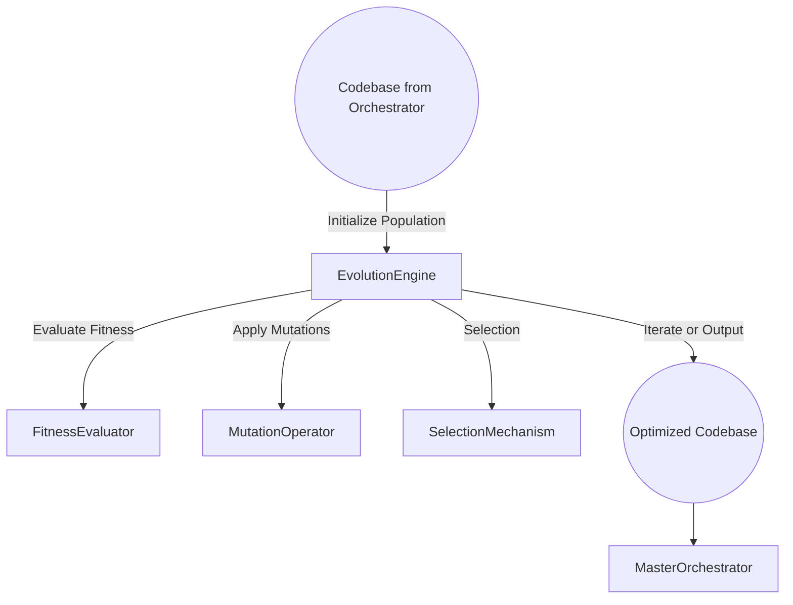

#### **7.3.2 Component Diagram**

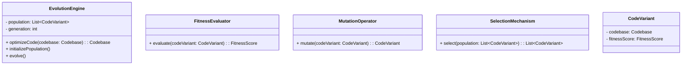

### **7.4 Detailed Design**

#### **7.4.1 optimizeCode Method**

- **Input**: `codebase: Codebase`
- **Flow**:
  1. **Initialize Population**: Generate an initial population of code variants.
  2. **Evolution Loop**:
     - Evaluate fitness of each variant using `FitnessEvaluator`.
     - Select the fittest variants using `SelectionMechanism`.
     - Apply mutations using `MutationOperator` to create a new generation.
     - Repeat for a predefined number of generations or until convergence.
  3. **Output**: Return the most optimal code variant to the Master Orchestrator.

#### **7.4.2 FitnessEvaluator**

- **Function**: Assigns a fitness score to each code variant based on evaluation metrics.
- **Evaluation Metrics**:
  - **Performance**: Execution time, memory usage.
  - **Security**: Number of vulnerabilities detected.
  - **Maintainability**: Code complexity, readability.
  - **Test Coverage**: Percentage of code covered by tests.
- **Implementation**:
  - Use static analysis tools (e.g., SonarQube) for code quality metrics.
  - Use profiling tools for performance metrics.
  - Use security scanners (e.g., Bandit) for vulnerability assessment.
  - Integrate coverage tools (e.g., `coverage.py`) for test coverage.

#### **7.4.3 MutationOperator**

- **Function**: Applies mutations to code variants to explore new solutions.
- **Mutation Types**:
  - **Code Refactoring**: Simplify code structures without changing functionality.
  - **Optimization Mutations**: Enhance performance (e.g., algorithm improvements).
  - **Security Enhancements**: Apply secure coding practices.
  - **Dead Code Elimination**: Remove unnecessary code segments.
- **Implementation**:
  - Use Abstract Syntax Tree (AST) manipulation for code transformations.
  - Ensure mutations maintain syntactic and semantic correctness.
- **Example Mutation**:

```python
# Before Mutation
def compute(values):
    result = 0
    for i in range(len(values)):
        result += values[i]
    return result

# After Mutation (Using built-in sum function)
def compute(values):
    return sum(values)
```

#### **7.4.4 SelectionMechanism**

- **Function**: Selects the fittest code variants for the next generation.
- **Selection Strategies**:
  - **Roulette Wheel Selection**: Probabilistic selection based on fitness scores.
  - **Tournament Selection**: Randomly select a subset and choose the best.
  - **Elitism**: Always carry forward the best-performing variants.
- **Implementation**:
  - Normalize fitness scores.
  - Implement selection algorithms to choose parents for next generation.

#### **7.4.5 CodeVariant**

- **Attributes**:
  - `codebase: Codebase`
  - `fitnessScore: FitnessScore`
- **Function**: Represents an individual code variant within the population.

### **7.5 Data Models**

#### **7.5.1 Codebase**

- Represents the entire code structure of the application.
- Contains all source files and configurations.

#### **7.5.2 FitnessScore**

- **Attributes**:
  - `performanceScore: float`
  - `securityScore: float`
  - `maintainabilityScore: float`
  - `testCoverageScore: float`
  - `totalScore: float`
- **Calculation**: The total score is a weighted sum of individual scores.

### **7.6 Sequence Diagram**

```mermaid
sequenceDiagram
    participant Orchestrator
    participant EvolutionEngine
    participant FitnessEvaluator
    participant MutationOperator
    participant SelectionMechanism

    Orchestrator->>EvolutionEngine: Send Codebase
    EvolutionEngine->>EvolutionEngine: Initialize Population
    loop For each Generation
        EvolutionEngine->>FitnessEvaluator: Evaluate Fitness
        FitnessEvaluator-->>EvolutionEngine: Fitness Scores
        EvolutionEngine->>SelectionMechanism: Select Fittest Variants
        SelectionMechanism-->>EvolutionEngine: Selected Variants
        EvolutionEngine->>MutationOperator: Apply Mutations
        MutationOperator-->>EvolutionEngine: New Code Variants
    end
    EvolutionEngine-->>Orchestrator: Return Optimized Codebase
```

### **7.7 Error Handling**

- **Syntax Errors**:
  - Validate code after mutations to ensure it compiles.
  - Discard variants with syntax errors.
- **Infinite Loops or Timeouts**:
  - Set execution time limits during fitness evaluation.
  - Terminate evaluation if time limit is exceeded.
- **Invalid Mutations**:
  - Ensure mutations do not alter expected functionality (use test suites for validation).
  - Revert or discard invalid variants.

### **7.8 Security Considerations**

- **Secure Coding Practices**:
  - Ensure mutations do not introduce vulnerabilities.
  - Incorporate security checks in fitness evaluation.
- **Data Privacy**:
  - Do not expose sensitive data during optimization.
- **Sandbox Execution**:
  - Run code evaluations in isolated environments to prevent unwanted side effects.

### **7.9 Performance Considerations**

- **Parallel Processing**:
  - Distribute fitness evaluations across multiple cores or machines.
  - Use concurrent processing to handle large populations.
- **Caching**:
  - Cache fitness scores of identical code variants to avoid redundant evaluations.
- **Generation Limits**:
  - Limit the number of generations to balance optimization and resource usage.

### **7.10 Dependencies**

- **Programming Language**: Python 3.11+
- **Libraries**:
  - `ast` for code parsing and manipulation.
  - `multiprocessing` or `asyncio` for parallelism.
- **Tools**:
  - **Static Analysis**: `pylint`, `flake8`
  - **Code Quality**: `SonarQube`, `CodeClimate`
  - **Security Scanning**: `Bandit`
  - **Performance Profiling**: `cProfile`, `line_profiler`

---

## **8. User Interface**

### **8.1 Introduction**

The **User Interface (UI)** component provides an interactive platform for users to interact with the system. It includes a web-based dashboard and possibly other client interfaces. The UI allows users to input requirements, monitor project progress, manage deployments, and receive notifications.

### **8.2 Responsibilities**

- **Requirement Input**: Allow users to enter and edit project requirements.
- **Project Monitoring**: Display real-time status updates and progress visualizations.
- **Deployment Management**: Provide controls for initiating and managing deployments.
- **User Authentication and Authorization**: Secure access to the application.
- **Responsive Design**: Ensure usability across various devices and screen sizes.

### **8.3 Architecture**

#### **8.3.1 High-Level Flow**

```mermaid
flowchart TD
    User -->|Access via Browser| UserInterface
    UserInterface -->|Submit Requirements| MasterOrchestrator
    UserInterface <--|Receive Updates| WebSockets
    UserInterface -->|Display Data| UIComponents
    UserInterface -->|Trigger Actions| APIGateway
```

#### **8.3.2 Component Diagram**

```mermaid
classDiagram
    class UserInterface {
        + render()
        + handleUserInput()
        + updateUI()
    }
    class UIComponents {
        + Dashboard
        + Forms
        + Charts
        + Tables
    }
    class StateManagement {
        + store: Store
        + actions
        + reducers
    }
    class Services {
        + APIService
        + WebSocketService
    }
```

### **8.4 Detailed Design**

#### **8.4.1 Technology Stack**

- **Frontend Framework**: React 18 with TypeScript
- **UI Library**: Material-UI (MUI) or Tailwind CSS
- **State Management**: Redux Toolkit or Zustand
- **Real-time Communication**: WebSockets (e.g., Socket.IO)
- **Build Tools**: Webpack, Babel

#### **8.4.2 Core Functions**

##### **8.4.2.1 Requirement Input**

- **Features**:
  - Interactive forms for entering project requirements.
  - Validation of input fields.
  - Ability to save and load requirement presets.
- **Implementation**:
  - Use controlled components in React for form fields.
  - Implement validation using libraries like `Formik` and `Yup`.
  - Modularize form components for reusability.

##### **8.4.2.2 Project Monitoring**

- **Features**:
  - Display status updates, progress bars, and logs.
  - Visualize data using charts (e.g., Gantt charts).
- **Implementation**:
  - Use charting libraries like `Recharts` or `Chart.js`.
  - Real-time updates via WebSockets.
  - Organize data visualization components for scalability.

##### **8.4.2.3 Deployment Management**

- **Features**:
  - Buttons and controls to initiate deployments.
  - Display deployment statuses and history.
- **Implementation**:
  - Integrate with API Gateway for backend communication.
  - Use modals and confirmation dialogs for critical actions.

#### **8.4.3 Routing and Navigation**

- **Implementation**:
  - Use `React Router` for client-side routing.
  - Define routes for different application views (e.g., `/dashboard`, `/projects`, `/settings`).

#### **8.4.4 State Management**

- **Implementation**:
  - Use **Redux Toolkit** for predictable state management.
  - Organize slices for different data domains (e.g., user, projects, notifications).
  - Implement asynchronous actions with `Redux Thunk` or `Redux Saga`.

#### **8.4.5 Services**

- **APIService**:
  - Handles HTTP requests to the backend via the API Gateway.
  - Use `axios` or Fetch API for requests.
- **WebSocketService**:
  - Establishes and manages WebSocket connections.
  - Listens for events and dispatches actions to update the UI.

#### **8.4.6 Security**

- **Authentication**:
  - Implement authentication flows (e.g., login, logout).
  - Use JSON Web Tokens (JWT) for session management.
- **Authorization**:
  - Control access to routes and components based on user roles.
- **Input Sanitization**:
  - Prevent XSS attacks by sanitizing user inputs and outputs.
- **Implementation**:
  - Use libraries like `jwt-decode` to handle tokens.
  - Securely store tokens (use HttpOnly cookies when possible).

### **8.5 Data Models**

#### **8.5.1 User**

```typescript
interface User {
  id: string;
  username: string;
  email: string;
  role: string; // e.g., 'admin', 'user'
  token: string;
}
```

#### **8.5.2 Project**

```typescript
interface Project {
  id: string;
  name: string;
  status: string;
  requirements: Requirements;
  progress: number; // 0 to 100
}
```

#### **8.5.3 Requirements**

```typescript
interface Requirements {
  description: string;
  projectType: string;
  features: string[];
  techStackPreferences: TechStackPreferences;
  deploymentTarget: string;
}
```

### **8.6 Sequence Diagram**

```mermaid
sequenceDiagram
    participant User
    participant UserInterface
    participant APIService
    participant APIGateway
    participant Orchestrator
    participant WebSocketService

    User->>UserInterface: Enter Requirements
    UserInterface->>APIService: Submit Requirements
    APIService->>APIGateway: POST /requirements
    APIGateway->>Orchestrator: Forward Request
    Orchestrator-->>APIGateway: Acknowledge
    APIGateway-->>APIService: Response
    APIService-->>UserInterface: Update UI
    Orchestrator->>WebSocketService: Send Status Updates
    WebSocketService->>UserInterface: Update Progress
```

### **8.7 Error Handling**

- **Network Errors**:
  - Implement global error handlers.
  - Display user-friendly error messages.
- **Form Validation Errors**:
  - Provide inline validation feedback.
  - Prevent form submission until all validations pass.
- **Authentication Errors**:
  - Handle token expiration and invalid tokens.
  - Redirect users to login page when unauthorized.

### **8.8 Security Considerations**

- **Prevent XSS Attacks**:
  - Use libraries like `DOMPurify` to sanitize user-generated content.
- **CSRF Protection**:
  - Implement CSRF tokens if using cookies for authentication.
- **Secure Storage**:
  - Avoid storing sensitive data in localStorage; prefer sessionStorage or in-memory.
- **Content Security Policy (CSP)**:
  - Define CSP headers to restrict resource loading.

### **8.9 Performance Considerations**

- **Lazy Loading**:
  - Implement code-splitting using `React.lazy` and `Suspense`.
- **Memoization**:
  - Use `React.memo` and `useMemo` to prevent unnecessary re-renders.
- **Asset Optimization**:
  - Compress images and assets.
  - Use CDN for static content delivery.
- **SEO Optimization**:
  - Implement server-side rendering (SSR) if necessary (e.g., with Next.js).

### **8.10 Dependencies**

- **Core Libraries**:
  - `react`, `react-dom`, `typescript`
- **State Management**:
  - `@reduxjs/toolkit`, `react-redux`
- **Routing**:
  - `react-router-dom`
- **UI Components**:
  - `@mui/material` or `tailwindcss`
- **Forms and Validation**:
  - `formik`, `yup`
- **Real-time Communication**:
  - `socket.io-client`
- **Build Tools**:
  - `webpack`, `babel`

---

## **9. API Gateway**

### **9.1 Introduction**

The **API Gateway** serves as the single entry point for all client requests to the backend services. It handles request routing, authentication, rate limiting, and acts as a reverse proxy. The gateway abstracts the complexity of the underlying microservices architecture from the clients.

### **9.2 Responsibilities**

- **Request Routing**: Forward client requests to appropriate backend services.
- **Authentication and Authorization**: Verify client credentials and enforce access control.
- **Rate Limiting**: Protect backend services from excessive requests.
- **Load Balancing**: Distribute requests among multiple service instances.
- **API Aggregation**: Combine responses from multiple services when necessary.
- **Monitoring and Logging**: Collect metrics and logs for monitoring.

### **9.3 Architecture**

#### **9.3.1 High-Level Flow**

```mermaid
flowchart TD
    ClientRequest((Client Request)) -->|HTTPS Request| APIGateway
    APIGateway -->|Authenticate| AuthService
    APIGateway -->|Route Request| BackendServices
    BackendServices --> APIGateway
    APIGateway -->|Response| Client
```

#### **9.3.2 Component Diagram**

```mermaid
classDiagram
    class APIGateway {
        + handleRequest(request)
        + authenticate(request)
        + authorize(request)
        + routeRequest(request)
    }
    class AuthService {
        + verifyToken(token)
        + getUserRoles(token)
    }
    class RateLimiter {
        + checkRateLimit(clientId)
    }
    class BackendServices {
        <<microservice>>
    }
```

### **9.4 Detailed Design**

#### **9.4.1 Technology Stack**

- **Gateway Framework**: Node.js with Express.js or Fastify
- **Authentication**: JWT validation middleware
- **Secure Communication**: HTTPS with SSL/TLS
- **Reverse Proxy**: Nginx or HAProxy (optional)
- **API Documentation**: OpenAPI (Swagger)

#### **9.4.2 Core Functions**

##### **9.4.2.1 Authentication and Authorization**

- **Implementation**:
  - Use JWT tokens for stateless authentication.
  - Implement middleware to validate tokens.
  - Extract user roles and permissions from token claims.
  - Enforce access control based on roles.

##### **9.4.2.2 Request Routing**

- **Implementation**:
  - Define route mappings to backend services.
  - Use dynamic routing when necessary.
  - Handle URI parameters and query strings appropriately.

##### **9.4.2.3 Rate Limiting**

- **Implementation**:
  - Use in-memory stores like Redis for tracking request counts.
  - Implement algorithms like Token Bucket or Leaky Bucket.
  - Customize rate limits per API key or IP address.

##### **9.4.2.4 Load Balancing**

- **Implementation**:
  - Use round-robin or least connections strategies.
  - Integrate with service discovery mechanisms if using container orchestration (e.g., Kubernetes).

##### **9.4.2.5 Monitoring and Logging**

- **Implementation**:
  - Use logging libraries like `winston`.
  - Collect metrics (e.g., request counts, response times) using tools like Prometheus.
  - Set up alerts for error rates and performance issues.

#### **9.4.3 Security**

- **Input Validation**:
  - Sanitize request inputs to prevent injection attacks.
- **HTTPS Enforcement**:
  - Redirect HTTP requests to HTTPS.
  - Use strong cipher suites.
- **CORS Configuration**:
  - Configure Cross-Origin Resource Sharing policies.
- **API Keys**:
  - Provide API keys for third-party integrations.
  - Securely store and manage API keys.

### **9.5 Data Models**

#### **9.5.1 API Request**

```typescript
interface APIRequest {
  method: string;
  path: string;
  headers: Record<string, string>;
  queryParams: Record<string, string>;
  body: any;
}
```

#### **9.5.2 Auth Token**

```typescript
interface AuthToken {
  sub: string; // Subject (user identifier)
  exp: number; // Expiration time
  roles: string[]; // User roles
  permissions: string[]; // Specific permissions
}
```

### **9.6 Sequence Diagram**

```mermaid
sequenceDiagram
    participant Client
    participant APIGateway
    participant AuthService
    participant BackendService

    Client->>APIGateway: Request with JWT
    APIGateway->>AuthService: Validate JWT
    AuthService-->>APIGateway: User Info
    APIGateway->>RateLimiter: Check Rate Limit
    RateLimiter-->>APIGateway: Allowed
    APIGateway->>BackendService: Forward Request
    BackendService-->>APIGateway: Response
    APIGateway-->>Client: Response
```

### **9.7 Error Handling**

- **Authentication Failures**:
  - Return `401 Unauthorized` status code.
  - Provide error messages without revealing sensitive details.
- **Authorization Errors**:
  - Return `403 Forbidden` status code.
- **Rate Limit Exceeded**:
  - Return `429 Too Many Requests` status code.
  - Include `Retry-After` header specifying when to retry.
- **Service Unavailable**:
  - Handle backend service failures gracefully.
  - Return `503 Service Unavailable` status code.

### **9.8 Security Considerations**

- **API Throttling**:
  - Prevent abuse and DoS attacks by limiting request rates.
- **Input Sanitization**:
  - Prevent injection attacks by validating all inputs.
- **Logging Sensitive Data**:
  - Avoid logging sensitive information (e.g., passwords, tokens).
- **Penetration Testing**:
  - Regularly perform security assessments.

### **9.9 Performance Considerations**

- **Caching**:
  - Implement response caching for idempotent GET requests.
  - Use HTTP cache headers (`ETag`, `Cache-Control`).
- **Asynchronous Processing**:
  - Support asynchronous request handling where appropriate.
- **Resource Optimization**:
  - Optimize memory usage and avoid blocking the event loop.

### **9.10 Dependencies**

- **Node.js Packages**:
  - `express` or `fastify` for server framework
  - `jsonwebtoken` for JWT handling
  - `express-rate-limit` or custom rate limiter
  - `helmet` for security headers
- **External Services**:
  - AuthService for user authentication
  - Redis for rate limiting state
- **API Documentation**:
  - `swagger-ui-express` for API docs

---

## **10. CLI Tool**

### **10.1 Introduction**

The **Command-Line Interface (CLI) Tool** allows power users and developers to interact with the system via the command line. It supports project setup, requirement specification, batch processing, and integrates with the Master Orchestrator through APIs.

### **10.2 Responsibilities**

- **Project Initialization**: Create and scaffold new projects.
- **Requirement Specification**: Input project requirements in a structured manner.
- **Batch Processing**: Process multiple projects or configurations in batch mode.
- **Integration with Orchestrator**: Communicate with backend services via APIs.
- **User Authentication**: Handle authentication for secure operations.
- **Ease of Use**: Provide intuitive commands and help documentation.

### **10.3 Architecture**

#### **10.3.1 High-Level Flow**

```mermaid
flowchart TD
    UserInput((CLI Commands)) -->|Parse| CLI_Tool
    CLI_Tool -->|Authenticate| AuthModule
    CLI_Tool -->|Execute Command| CommandHandlers
    CommandHandlers -->|API Calls| APIGateway
    APIGateway --> Orchestrator
```

#### **10.3.2 Component Diagram**

```mermaid
classDiagram
    class CLITool {
        + main()
        + parseArguments()
        + executeCommand()
    }
    class CommandHandlers {
        + initProject()
        + submitRequirements()
        + batchProcess()
    }
    class AuthModule {
        + login()
        + storeToken()
        + refreshToken()
    }
    class APIClient {
        + sendRequest(endpoint: string, data: any)
    }
```

### **10.4 Detailed Design**

#### **10.4.1 Technology Stack**

- **Programming Language**: Python 3.11+
- **Packaging**: Use `argparse` or `click` library for command parsing.
- **HTTP Requests**: Use `requests` library for API communication.
- **JSON Handling**: Use `json` module for data serialization.

#### **10.4.2 Core Functions**

##### **10.4.2.1 Project Initialization**

- **Command**: `cli-tool init [project-name]`
- **Features**:
  - Create a new project directory.
  - Generate necessary configuration files.
- **Implementation**:
  - Use templates for configuration files.
  - Handle naming conflicts.

##### **10.4.2.2 Requirement Specification**

- **Command**: `cli-tool submit-requirements [options]`
- **Features**:
  - Accept requirements via command-line options or input files.
  - Validate and serialize requirements.
- **Implementation**:
  - Use `argparse` for option parsing.
  - Support JSON or YAML input files.

##### **10.4.2.3 Batch Processing**

- **Command**: `cli-tool batch-process [file]`
- **Features**:
  - Process multiple projects defined in a file.
  - Support parallel processing.
- **Implementation**:
  - Read batch files and iterate over entries.
  - Optionally use multithreading.

##### **10.4.2.4 Authentication**

- **Commands**:
  - `cli-tool login`
  - `cli-tool logout`
- **Features**:
  - Prompt user for credentials.
  - Store tokens securely (e.g., using keyring or OS credential store).
- **Implementation**:
  - Use `getpass` for password input.
  - Securely store and retrieve tokens.

##### **10.4.2.5 Help and Documentation**

- **Command**: `cli-tool --help` or `cli-tool [command] --help`
- **Features**:
  - Provide usage instructions.
  - Explain available commands and options.
- **Implementation**:
  - Use docstrings and `argparse` help formatter.

### **10.5 Data Models**

#### **10.5.1 Configuration File**

```yaml
project:
  name: "my_project"
  description: "A sample project"
requirements:
  projectType: "FULL_STACK"
  features:
    - "User authentication"
    - "Task management"
  techStackPreferences:
    frontend: "React with TypeScript"
    backend: "FastAPI"
    database: "PostgreSQL"
  deploymentTarget: "DOCKER"
```

#### **10.5.2 Command-Line Options**

- **Global Options**:
  - `--verbose`: Enable verbose output.
  - `--config`: Specify custom configuration file.
- **Authentication Options**:
  - `--username`
  - `--password`

### **10.6 Sequence Diagram**

```mermaid
sequenceDiagram
    participant User
    participant CLITool
    participant AuthModule
    participant APIClient
    participant APIGateway
    participant Orchestrator

    User->>CLITool: Run Command
    CLITool->>AuthModule: Check Authentication
    AuthModule-->>CLITool: Authentication Status
    CLITool->>APIClient: Send API Request
    APIClient->>APIGateway: HTTP Request
    APIGateway->>Orchestrator: Forward Request
    Orchestrator-->>APIGateway: Response
    APIGateway-->>APIClient: HTTP Response
    APIClient-->>CLITool: Data
    CLITool-->>User: Output Results
```

### **10.7 Error Handling**

- **Invalid Commands**:
  - Display helpful error messages.
  - Suggest valid commands.
- **Network Errors**:
  - Handle timeouts and connection issues.
  - Retry mechanism for transient errors.
- **Authentication Failures**:
  - Prompt user to re-authenticate.
  - Provide reasons for failure.

### **10.8 Security Considerations**

- **Secure Storage**:
  - Avoid storing passwords in plain text.
  - Use OS-specific credential stores.
- **Input Validation**:
  - Validate all inputs before processing.
- **Dependency Management**:
  - Use virtual environments to isolate dependencies.
  - Regularly update packages to patch vulnerabilities.

### **10.9 Performance Considerations**

- **Parallel Processing**:
  - Use multithreading or asyncio for batch operations.
- **Logging**:
  - Provide logging levels (INFO, DEBUG, ERROR).
  - Optionally log to files for auditing.

### **10.10 Dependencies**

- **Python Libraries**:
  - `argparse` or `click` for CLI parsing
  - `requests` for HTTP requests
  - `json`, `yaml` for configuration files
  - `keyring` for secure credential storage
- **Packaging Tools**:
  - `setuptools` or `poetry` for packaging and distribution
- **Optional Tools**:
  - `pytest` for testing the CLI tool
  - `sphinx` for generating documentation

---

# **Conclusion**

These detailed engineering documents provide comprehensive technical specifications.
