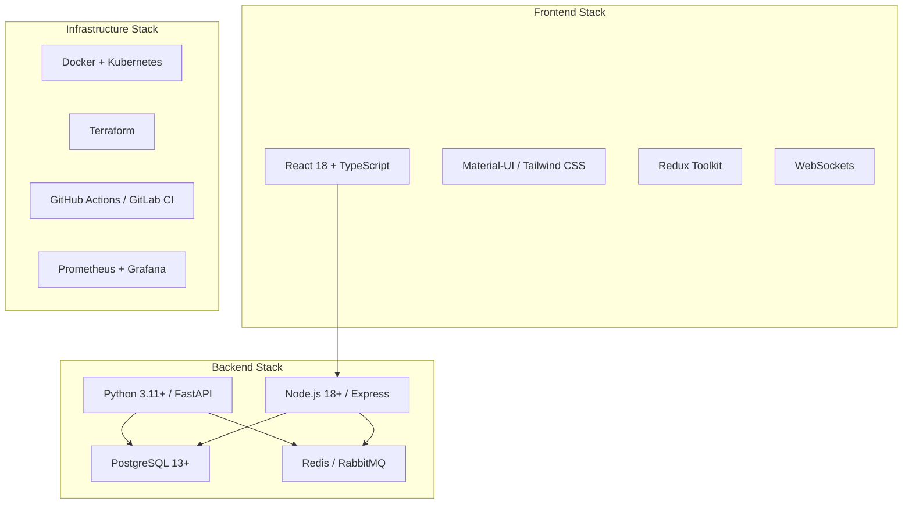
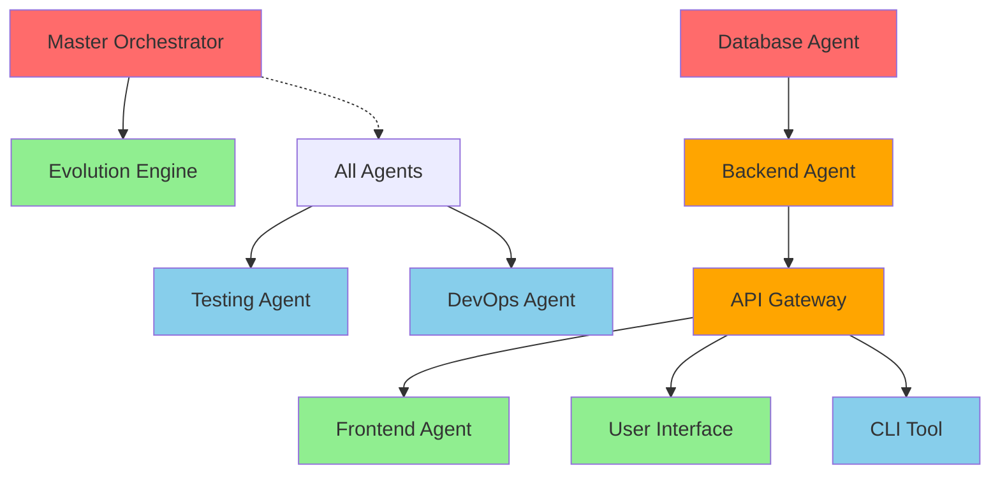
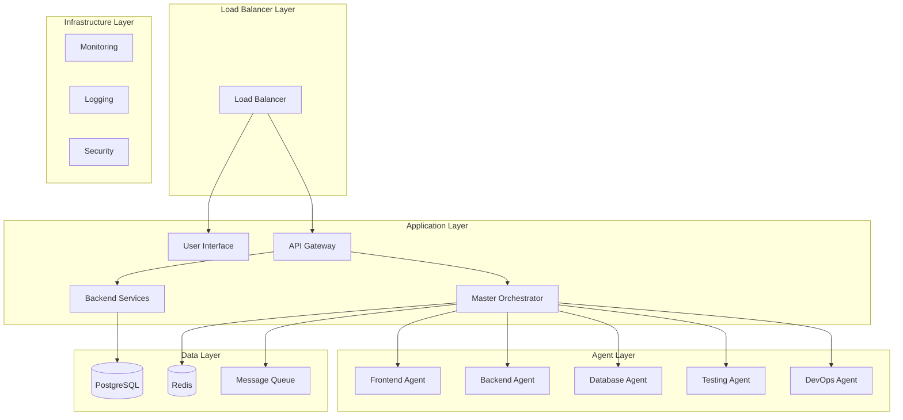

# Implementation Roadmap

## Executive Summary

This comprehensive implementation roadmap provides a strategic approach to building the Agentic AI Development Platform. The roadmap is structured around four main phases, with careful consideration of component dependencies, parallel development opportunities, and risk mitigation strategies.

**Total Estimated Timeline**: 12-14 weeks  
**Team Size**: 8-12 developers across multiple specializations  
**Critical Path**: Foundation → Core Services → User Interfaces → Quality & Deployment

## Table of Contents

1. [Project Overview](#project-overview)
2. [Component Dependency Analysis](#component-dependency-analysis)
3. [Implementation Phases](#implementation-phases)
4. [Detailed Task Breakdown](#detailed-task-breakdown)
5. [Risk Management](#risk-management)
6. [Resource Allocation](#resource-allocation)
7. [Testing and Validation Strategy](#testing-and-validation-strategy)
8. [Deployment and Scaling](#deployment-and-scaling)
9. [Success Metrics](#success-metrics)

## Project Overview

### System Architecture

The Agentic AI Development Platform consists of 10 interconnected components:

- **Core Architecture**: Master Orchestrator, Evolution Engine
- **Specialized Agents**: Frontend, Backend, Database, Testing
- **Infrastructure**: DevOps Agent, API Gateway
- **User Interfaces**: Web UI, CLI Tool

### Technology Stack



## Component Dependency Analysis

### Critical Dependencies Matrix

| Component | Direct Dependencies | Blocking Impact | Development Priority |
|-----------|-------------------|-----------------|--------------------|
| **Master Orchestrator** | None | HIGH - Blocks Evolution Engine | 🔴 Critical |
| **Database Agent** | None | HIGH - Blocks Backend Agent | 🔴 Critical |
| **API Gateway** | None | MEDIUM - Blocks UI components | 🟡 High |
| **Backend Agent** | Database Agent | MEDIUM - Blocks Frontend | 🟡 High |
| **Evolution Engine** | Master Orchestrator | LOW - Optimization only | 🟢 Medium |
| **Frontend Agent** | API Gateway, Backend | LOW - Code generation | 🟢 Medium |
| **User Interface** | API Gateway | LOW - User interaction | 🟢 Medium |
| **CLI Tool** | API Gateway | LOW - Power user tools | 🟢 Low |
| **Testing Agent** | All code components | LOW - Quality assurance | 🟢 Low |
| **DevOps Agent** | All components | LOW - Deployment | 🟢 Low |

### Dependency Flow Diagram



## Implementation Phases

### Phase 1: Foundation Components (Weeks 1-4)

**Objective**: Establish core infrastructure and foundational components

**Components**:
- Master Orchestrator
- Database Agent
- API Gateway

**Key Deliverables**:
- Basic orchestration workflow
- Database schema design and ORM models
- Authentication and request routing
- Core API endpoints

**Parallel Development Strategy**:
- 3 teams working simultaneously
- Clear interface definitions to enable parallel work
- Weekly integration checkpoints

### Phase 2: Core Services (Weeks 5-7)

**Objective**: Build core business logic and optimization capabilities

**Components**:
- Backend Agent
- Evolution Engine

**Key Deliverables**:
- Complete CRUD operations and business logic
- Code optimization algorithms
- Integration with Master Orchestrator
- API endpoints for all core functions

**Dependencies**:
- Backend Agent: Requires Database Agent ORM models
- Evolution Engine: Requires Master Orchestrator interfaces

### Phase 3: User-Facing Components (Weeks 8-10)

**Objective**: Implement user interfaces and code generation agents

**Components**:
- Frontend Agent
- User Interface
- CLI Tool

**Key Deliverables**:
- React component generation
- Interactive web dashboard
- Command-line interface
- Real-time progress tracking

**Parallel Development Strategy**:
- All components can be developed simultaneously
- Shared API Gateway dependency resolved in Phase 1

### Phase 4: Quality Assurance & Deployment (Weeks 11-12)

**Objective**: Ensure system quality and automate deployment

**Components**:
- Testing Agent
- DevOps Agent

**Key Deliverables**:
- Comprehensive test suite generation
- Security vulnerability scanning
- Containerization and CI/CD pipelines
- Infrastructure as Code
- Monitoring and logging setup

## Detailed Task Breakdown

### Phase 1 Tasks (Weeks 1-4)

#### Master Orchestrator (Team A - 3 developers)

**Week 1-2: Core Framework**
- [ ] Project setup and development environment
- [ ] NLP processor implementation (spaCy integration)
- [ ] Task decomposition algorithm
- [ ] Basic agent coordinator framework
- [ ] Error handling and logging system

**Week 3-4: Integration & Testing**
- [ ] Code aggregator implementation
- [ ] Async task management
- [ ] Integration testing framework
- [ ] Performance optimization
- [ ] Documentation and API specs

#### Database Agent (Team B - 2 developers)

**Week 1-2: Schema Design**
- [ ] Entity-relationship modeling
- [ ] Database schema creation
- [ ] SQLAlchemy model generation
- [ ] Migration scripts setup (Alembic)
- [ ] Basic CRUD operations

**Week 3-4: Optimization & Integration**
- [ ] Query optimization
- [ ] Index creation strategies
- [ ] Connection pooling
- [ ] Integration with Backend Agent interfaces
- [ ] Performance testing

#### API Gateway (Team C - 2 developers)

**Week 1-2: Core Gateway**
- [ ] Express.js/Fastify setup
- [ ] JWT authentication middleware
- [ ] Request routing system
- [ ] Rate limiting implementation
- [ ] CORS configuration

**Week 3-4: Advanced Features**
- [ ] Load balancing logic
- [ ] API documentation (Swagger)
- [ ] Monitoring and metrics
- [ ] Security headers and validation
- [ ] Error handling middleware

### Phase 2 Tasks (Weeks 5-7)

#### Backend Agent (Team A - 3 developers)

**Week 5-6: FastAPI Implementation**
- [ ] FastAPI application setup
- [ ] Pydantic model definitions
- [ ] Endpoint implementation
- [ ] Authentication integration
- [ ] Database integration

**Week 7: Testing & Optimization**
- [ ] Unit and integration tests
- [ ] Performance optimization
- [ ] Error handling
- [ ] API documentation
- [ ] Deployment preparation

#### Evolution Engine (Team B - 2 developers)

**Week 5-6: Core Algorithm**
- [ ] Fitness evaluation framework
- [ ] Mutation operators implementation
- [ ] Selection mechanisms
- [ ] AST manipulation utilities
- [ ] Code variant management

**Week 7: Integration & Testing**
- [ ] Master Orchestrator integration
- [ ] Performance benchmarking
- [ ] Parallel processing optimization
- [ ] Error recovery mechanisms
- [ ] Documentation and examples

### Phase 3 Tasks (Weeks 8-10)

#### Frontend Agent (Team A - 2 developers)

**Week 8-9: Component Generation**
- [ ] React component templates
- [ ] TypeScript code generation
- [ ] UI library integration (Material-UI/Tailwind)
- [ ] Component testing generation
- [ ] Build system configuration

**Week 10: Integration & Testing**
- [ ] API Gateway integration
- [ ] Error handling and validation
- [ ] Performance optimization
- [ ] Documentation and examples

#### User Interface (Team B - 3 developers)

**Week 8-9: Core UI**
- [ ] React application setup
- [ ] Authentication flows
- [ ] Dashboard components
- [ ] Form components for requirements
- [ ] Real-time WebSocket integration

**Week 10: Advanced Features**
- [ ] Progress visualization
- [ ] Project management interface
- [ ] Settings and configuration
- [ ] Responsive design
- [ ] User testing and refinement

#### CLI Tool (Team C - 1 developer)

**Week 8-10: Full Implementation**
- [ ] Command parsing setup (argparse/click)
- [ ] Authentication module
- [ ] Project initialization commands
- [ ] Batch processing functionality
- [ ] API client implementation
- [ ] Error handling and help system
- [ ] Testing and documentation

### Phase 4 Tasks (Weeks 11-12)

#### Testing Agent (Team A - 2 developers)

**Week 11-12: Testing Framework**
- [ ] Test generation algorithms
- [ ] Code analysis integration
- [ ] Security scanning (Bandit, OWASP ZAP)
- [ ] Coverage analysis
- [ ] CI/CD integration
- [ ] Reporting and visualization

#### DevOps Agent (Team B - 2 developers)

**Week 11-12: Infrastructure Automation**
- [ ] Docker containerization
- [ ] Terraform scripts
- [ ] CI/CD pipeline templates
- [ ] Monitoring setup (Prometheus/Grafana)
- [ ] Logging configuration (ELK/EFK)
- [ ] Security compliance checks

## Risk Management

### High-Risk Dependencies

#### Risk 1: Database Agent Delays Block Backend Development
**Impact**: High - Could delay entire backend stack  
**Probability**: Medium  
**Mitigation Strategy**:
- Start with mock data models for Backend Agent development
- Define clear ORM interfaces early
- Implement database-agnostic abstraction layer
- Weekly checkpoint meetings between teams

#### Risk 2: Master Orchestrator Complexity Underestimated
**Impact**: High - Core system dependency  
**Probability**: Medium  
**Mitigation Strategy**:
- Implement MVP version first (basic workflow)
- Break down into smaller, testable components
- Allocate strongest technical team
- Plan for 25% schedule buffer

#### Risk 3: Integration Complexity Between Components
**Impact**: Medium - Could require rework  
**Probability**: High  
**Mitigation Strategy**:
- Define comprehensive API contracts early
- Implement integration testing from day one
- Use API mocking for parallel development
- Weekly cross-team integration meetings

### Medium-Risk Factors

#### Risk 4: Technology Stack Learning Curve
**Impact**: Medium - Could slow development  
**Probability**: Medium  
**Mitigation Strategy**:
- Provide technology training upfront
- Pair experienced developers with newcomers
- Create comprehensive development guides
- Allow extra time for technology adoption

#### Risk 5: Performance Requirements Not Met
**Impact**: Medium - Could require architecture changes  
**Probability**: Low  
**Mitigation Strategy**:
- Define performance benchmarks early
- Implement monitoring from the start
- Plan for optimization sprints
- Use proven technology patterns

### Risk Monitoring Process

**Weekly Risk Review**:
- Assess progress against milestones
- Identify new risks or changes to existing risks
- Update mitigation strategies
- Communicate risks to stakeholders

**Risk Escalation Criteria**:
- Any risk that could delay project by >1 week
- Technical risks requiring architecture changes
- Resource risks affecting team availability

## Resource Allocation

### Team Structure by Phase

#### Phase 1 Teams (Weeks 1-4)

**Team A: Master Orchestrator**
- 1 Senior Python Developer (Team Lead)
- 1 Senior Python Developer (NLP/AI expertise)
- 1 Mid-level Python Developer

**Team B: Database Agent**
- 1 Senior Database Developer (Team Lead)
- 1 Mid-level Python Developer (ORM expertise)

**Team C: API Gateway**
- 1 Senior Node.js Developer (Team Lead)
- 1 Mid-level Node.js Developer

#### Phase 2 Teams (Weeks 5-7)

**Team A: Backend Agent**
- 1 Senior Python Developer (Team Lead)
- 1 Senior FastAPI Developer
- 1 Mid-level Python Developer

**Team B: Evolution Engine**
- 1 Senior Python Developer (Algorithm expertise)
- 1 Mid-level Python Developer

#### Phase 3 Teams (Weeks 8-10)

**Team A: Frontend Agent**
- 1 Senior React Developer
- 1 Mid-level TypeScript Developer

**Team B: User Interface**
- 1 Senior React Developer (Team Lead)
- 1 Senior UI/UX Developer
- 1 Mid-level Frontend Developer

**Team C: CLI Tool**
- 1 Mid-level Python Developer

#### Phase 4 Teams (Weeks 11-12)

**Team A: Testing Agent**
- 1 Senior QA Engineer (Team Lead)
- 1 Mid-level DevOps Engineer

**Team B: DevOps Agent**
- 1 Senior DevOps Engineer (Team Lead)
- 1 Mid-level DevOps Engineer

### Skill Requirements Matrix

| Skill | Phase 1 | Phase 2 | Phase 3 | Phase 4 | Total Required |
|-------|---------|---------|---------|---------|----------------|
| **Senior Python** | 3 | 2 | 0 | 1 | 3-4 developers |
| **Senior Node.js** | 1 | 0 | 0 | 0 | 1 developer |
| **Senior React** | 0 | 0 | 2 | 0 | 2 developers |
| **Database Specialist** | 1 | 0 | 0 | 0 | 1 developer |
| **DevOps Engineer** | 0 | 0 | 0 | 2 | 2 developers |
| **QA Engineer** | 0 | 0 | 0 | 1 | 1 developer |
| **UI/UX Designer** | 0 | 0 | 1 | 0 | 1 developer |

### Cross-Training Opportunities

**Phase Transitions**:
- Master Orchestrator team → Evolution Engine (Python expertise)
- Database team → Backend Agent (ORM knowledge)
- API Gateway team → DevOps Agent (Infrastructure knowledge)
- Frontend Agent team → User Interface (React expertise)

## Testing and Validation Strategy

### Testing Pyramid Structure

```mermaid
pyramid
    Unit Tests [70%]
    Integration Tests [20%]
    End-to-End Tests [10%]
```

### Phase-Specific Testing Strategies

#### Phase 1: Foundation Testing

**Master Orchestrator Testing**:
- [ ] Unit tests for NLP processing
- [ ] Unit tests for task decomposition
- [ ] Integration tests for agent coordination
- [ ] Performance tests for concurrent task handling
- [ ] Mock agent testing

**Database Agent Testing**:
- [ ] Unit tests for ORM models
- [ ] Integration tests with PostgreSQL
- [ ] Migration testing
- [ ] Performance tests for query optimization
- [ ] Connection pooling tests

**API Gateway Testing**:
- [ ] Unit tests for middleware
- [ ] Integration tests for authentication
- [ ] Load testing for rate limiting
- [ ] Security testing for input validation
- [ ] Mock backend service testing

#### Phase 2: Core Services Testing

**Backend Agent Testing**:
- [ ] Unit tests for business logic
- [ ] Integration tests with Database Agent
- [ ] API endpoint testing
- [ ] Authentication flow testing
- [ ] Performance testing under load

**Evolution Engine Testing**:
- [ ] Unit tests for fitness evaluation
- [ ] Unit tests for mutation operators
- [ ] Integration tests with Master Orchestrator
- [ ] Performance tests for optimization cycles
- [ ] Code correctness validation tests

#### Phase 3: User Interface Testing

**Frontend Agent Testing**:
- [ ] Unit tests for component generation
- [ ] Integration tests with UI libraries
- [ ] Generated code validation tests
- [ ] Build system testing
- [ ] Cross-browser compatibility tests

**User Interface Testing**:
- [ ] Unit tests for React components
- [ ] Integration tests with API Gateway
- [ ] User interaction testing (Cypress)
- [ ] Responsive design testing
- [ ] Accessibility testing

**CLI Tool Testing**:
- [ ] Unit tests for command parsing
- [ ] Integration tests with API Gateway
- [ ] Authentication flow testing
- [ ] Batch processing tests
- [ ] Error handling tests

#### Phase 4: Quality Assurance Testing

**Testing Agent Testing**:
- [ ] Unit tests for test generation algorithms
- [ ] Integration tests with code analysis tools
- [ ] Security scanning validation
- [ ] Coverage analysis accuracy
- [ ] CI/CD pipeline integration tests

**DevOps Agent Testing**:
- [ ] Docker build testing
- [ ] Terraform validation
- [ ] CI/CD pipeline testing
- [ ] Infrastructure provisioning tests
- [ ] Monitoring and alerting tests

### Automated Testing Infrastructure

**Continuous Integration Setup**:
- GitHub Actions / GitLab CI pipelines
- Automated testing on pull requests
- Code coverage reporting
- Security scanning integration
- Performance regression testing

**Testing Environments**:
- **Development**: Local development with Docker Compose
- **Staging**: Cloud-based environment mirroring production
- **Production**: Live environment with monitoring

### Quality Gates

**Phase Completion Criteria**:
- [ ] 90%+ unit test coverage
- [ ] All integration tests passing
- [ ] Security scans with no critical vulnerabilities
- [ ] Performance benchmarks met
- [ ] Documentation completed
- [ ] Code review completed

## Deployment and Scaling

### Infrastructure Architecture



### Deployment Strategy

#### Development Environment

**Local Development Setup**:
- Docker Compose for local services
- Hot reloading for rapid development
- Local database instances
- Mock external services

**Development Tools**:
- Visual Studio Code with extensions
- Docker Desktop
- Postman for API testing
- pgAdmin for database management

#### Staging Environment

**Cloud Infrastructure**:
- Kubernetes cluster (AWS EKS / GCP GKE / Azure AKS)
- Managed database services (RDS / Cloud SQL)
- Container registry (ECR / GCR / ACR)
- Load balancers and ingress controllers

**CI/CD Pipeline**:
- Automated deployment on merge to staging branch
- Database migration automation
- Integration testing in staging environment
- Performance testing and monitoring

#### Production Environment

**High Availability Setup**:
- Multi-zone deployment
- Database replication and backups
- Auto-scaling groups
- Health checks and monitoring

**Security Measures**:
- Network security groups
- SSL/TLS encryption
- Secret management (Vault / AWS Secrets Manager)
- Regular security updates

### Scaling Considerations

#### Horizontal Scaling Strategies

**Stateless Components** (Easy to scale):
- API Gateway instances
- Backend Agent instances
- Frontend Agent instances
- User Interface instances

**Stateful Components** (Requires planning):
- Master Orchestrator (leader election)
- Database Agent (connection pooling)
- Message queues (clustering)

#### Performance Optimization

**Caching Strategy**:
- Redis for session management
- Application-level caching
- CDN for static assets
- Database query caching

**Database Optimization**:
- Read replicas for scaling reads
- Connection pooling
- Query optimization and indexing
- Database sharding if needed

**Monitoring and Alerting**:
- Application performance monitoring (APM)
- Infrastructure monitoring
- Custom business metrics
- Automated alerting and escalation

## Success Metrics

### Technical Metrics

#### Performance Metrics
- **Response Time**: API endpoints < 500ms (95th percentile)
- **Throughput**: Support 100+ concurrent users
- **Code Generation Speed**: Complete project < 10 minutes
- **System Uptime**: 99.5% availability

#### Quality Metrics
- **Test Coverage**: >90% for all components
- **Code Quality**: SonarQube rating A or above
- **Security**: Zero critical vulnerabilities
- **Documentation**: 100% API documentation coverage

### Business Metrics

#### User Adoption
- **Active Users**: Track daily/monthly active users
- **Project Creation Rate**: Number of projects generated per week
- **Feature Usage**: Most/least used features
- **User Satisfaction**: Regular user feedback surveys

#### Development Efficiency
- **Time to Market**: Reduction in development time
- **Code Quality**: Reduction in bugs in generated code
- **Developer Productivity**: Projects completed per developer
- **Learning Curve**: Time for new users to become productive

### Milestone Tracking

#### Phase 1 Success Criteria (Week 4)
- [ ] Master Orchestrator basic workflow functional
- [ ] Database schema deployed and tested
- [ ] API Gateway handling authentication and routing
- [ ] All components pass unit tests
- [ ] Integration between foundation components working

#### Phase 2 Success Criteria (Week 7)
- [ ] Backend Agent CRUD operations functional
- [ ] Evolution Engine basic optimization working
- [ ] API endpoints documented and tested
- [ ] Performance benchmarks met
- [ ] Integration with Phase 1 components stable

#### Phase 3 Success Criteria (Week 10)
- [ ] Frontend Agent generating React components
- [ ] User Interface fully functional
- [ ] CLI Tool supporting all major operations
- [ ] End-to-end user workflows working
- [ ] Real-time updates and WebSocket communication

#### Phase 4 Success Criteria (Week 12)
- [ ] Testing Agent generating comprehensive test suites
- [ ] DevOps Agent automating deployment
- [ ] Full system deployed to staging environment
- [ ] Security scans passing
- [ ] Monitoring and alerting operational
- [ ] Performance targets met under load

### Continuous Improvement

**Weekly Reviews**:
- Progress against timeline
- Technical debt assessment
- User feedback incorporation
- Performance optimization opportunities

**Monthly Retrospectives**:
- Process improvement identification
- Team productivity analysis
- Technology stack evaluation
- Roadmap adjustment based on learnings

**Quarterly Planning**:
- Feature roadmap updates
- Technology upgrades
- Scaling preparation
- Market feedback incorporation

---

## Conclusion

This implementation roadmap provides a comprehensive strategy for building the Agentic AI Development Platform. The phased approach ensures that critical dependencies are addressed first, while maximizing parallel development opportunities. With proper risk management, resource allocation, and quality assurance measures, the project can deliver a robust, scalable platform within the 12-14 week timeline.

Success depends on:
- Strong technical leadership and clear communication
- Adherence to defined interfaces and standards
- Continuous integration and testing practices
- Regular stakeholder feedback and course correction
- Focus on user experience and business value

The roadmap should be treated as a living document, updated regularly based on progress, learnings, and changing requirements.
