# **Agentic AI Full-Stack Tech Company Design Documents**

## **Table of Contents**

1. [Project Overview](#1-project-overview)
2. [System Architecture](#2-system-architecture)
   - [High-Level System Flow](#21-high-level-system-flow)
3. [Component Descriptions](#3-component-descriptions)
   - [3.1 Master Orchestrator](#31-master-orchestrator)
   - [3.2 Specialized Agents](#32-specialized-agents)
     - [Frontend Agent](#frontend-agent)
     - [Backend Agent](#backend-agent)
     - [Database Agent](#database-agent)
     - [DevOps Agent](#devops-agent)
     - [Testing Agent](#testing-agent)
   - [3.3 Evolution Engine](#33-evolution-engine)
   - [3.4 User Interface](#34-user-interface)
   - [3.5 API Gateway](#35-api-gateway)
   - [3.6 CLI Tool](#36-cli-tool)
4. [Detailed Component Flows](#4-detailed-component-flows)
   - [Master Orchestrator Flow](#master-orchestrator-flow)
   - [Frontend Agent Flow](#frontend-agent-flow)
   - [Backend Agent Flow](#backend-agent-flow)
   - [Database Agent Flow](#database-agent-flow)
   - [DevOps Agent Flow](#devops-agent-flow)
   - [Testing Agent Flow](#testing-agent-flow)
   - [Evolution Engine Flow](#evolution-engine-flow)
5. [Sequence Diagrams](#5-sequence-diagrams)
   - [Overall System Sequence](#overall-system-sequence)
6. [Deployment Architecture](#6-deployment-architecture)
7. [Data Models](#7-data-models)
8. [Conclusion](#8-conclusion)

---

## **1. Project Overview**

The goal is to create an autonomous AI-powered tech company capable of generating, deploying, and managing complete SaaS applications based on natural language requirements. The system combines agentic AI, evolutionary coding, and local inference to deliver production-ready applications.

---

## **2. System Architecture**

### **2.1 High-Level System Flow**

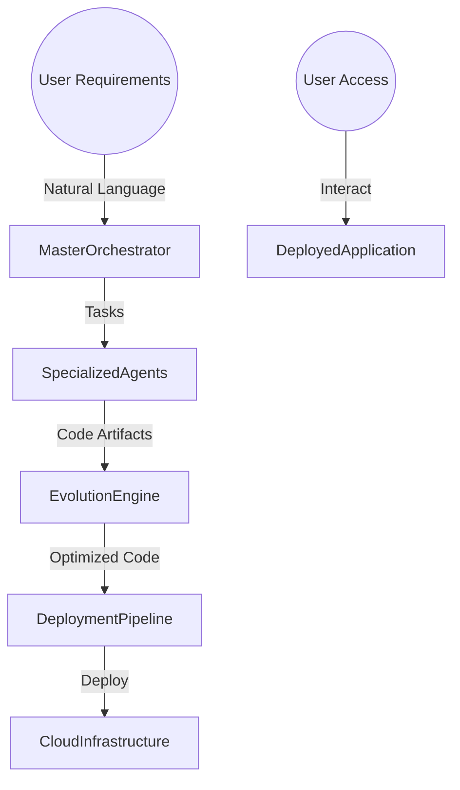

**Description:**

- **User Input**: Users provide natural language requirements through the web interface or CLI tool.
- **Master Orchestrator**: Parses requirements and decomposes them into tasks.
- **Specialized Agents**: Handle specific areas like frontend, backend, database, DevOps, and testing.
- **Evolution Engine**: Optimizes the generated code using evolutionary algorithms.
- **Deployment Pipeline**: Automates the deployment process to various targets.
- **Deployed Application**: The final product that users can interact with.

---

## **3. Component Descriptions**

### **3.1 Master Orchestrator**

Responsible for:

- Parsing natural language requirements using NLP techniques.
- Decomposing requirements into specific tasks.
- Coordinating specialized agents.
- Aggregating outputs from agents.
- Initiating the Evolution Engine for code optimization.

**Technologies:**

- Python 3.11+
- NLP Libraries (e.g., spaCy)
- Asyncio for asynchronous operations

### **3.2 Specialized Agents**

Agents focused on specific domains:

#### **Frontend Agent**

- **Responsibilities**:
  - Generate frontend code (React with TypeScript).
  - Integrate component libraries (Material-UI or Tailwind CSS).
  - Automate responsive design.
- **Technologies**:
  - Node.js 18+
  - React 18
  - TypeScript

#### **Backend Agent**

- **Responsibilities**:
  - Set up API frameworks (FastAPI).
  - Implement business logic.
  - Handle authentication and authorization.
- **Technologies**:
  - Python 3.11+
  - FastAPI
  - SQLAlchemy

#### **Database Agent**

- **Responsibilities**:
  - Design and optimize database schemas.
  - Manage migrations.
  - Optimize queries.
- **Technologies**:
  - PostgreSQL
  - Alembic for migrations

#### **DevOps Agent**

- **Responsibilities**:
  - Containerize applications using Docker.
  - Set up CI/CD pipelines.
  - Implement Infrastructure as Code (Terraform).
- **Technologies**:
  - Docker
  - GitHub Actions or GitLab CI
  - Terraform

#### **Testing Agent**

- **Responsibilities**:
  - Generate unit, integration, and E2E tests.
  - Perform automated code reviews.
  - Conduct security vulnerability scanning.
- **Technologies**:
  - Pytest
  - Selenium for E2E testing
  - Security tools like Bandit

### **3.3 Evolution Engine**

- Implements evolutionary algorithms to optimize code.
- Fitness evaluators assess code based on performance, security, maintainability, and test coverage.
- Applies mutations to improve code quality.

**Technologies:**

- OpenEvolve framework
- Custom mutation operators
- Fitness evaluation metrics

### **3.4 User Interface**

#### **Web Interface**

- **Features**:
  - React-based dashboard.
  - Real-time project monitoring.
  - Interactive requirement specification.
  - Deployment management interface.

#### **User Interface Flow**

```mermaid
flowchart TD
    User -->|Enter Requirements| WebInterface
    WebInterface --> MasterOrchestrator
    WebInterface <--|Progress Updates| MasterOrchestrator
    User <--|View Updates| WebInterface
```

### **3.5 API Gateway**

- Provides RESTful APIs for external integrations.
- Supports WebSocket connections for real-time updates.
- Handles authentication and rate limiting.

### **3.6 CLI Tool**

- Command-line interface for advanced users.
- Supports project templates and scaffolding.
- Allows batch processing capabilities.

---

## **4. Detailed Component Flows**

### **Master Orchestrator Flow**

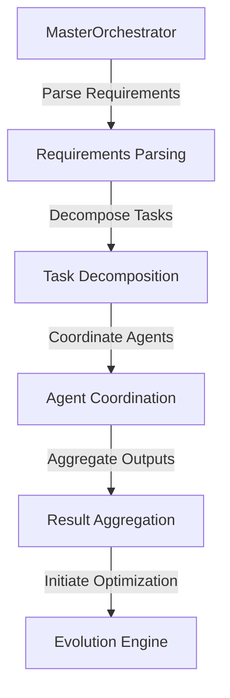

### **Frontend Agent Flow**

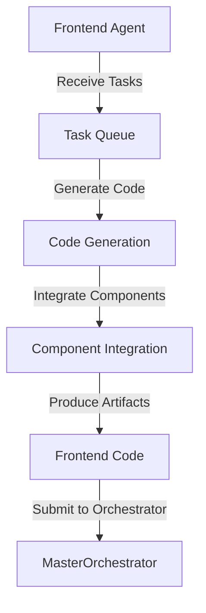

### **Backend Agent Flow**

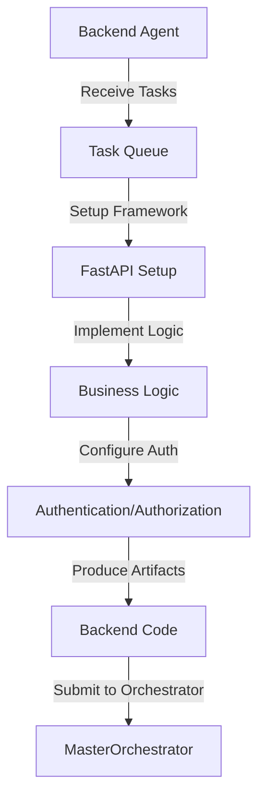

### **Database Agent Flow**

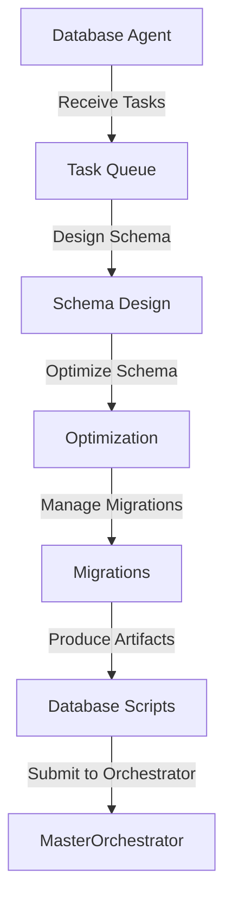

### **DevOps Agent Flow**

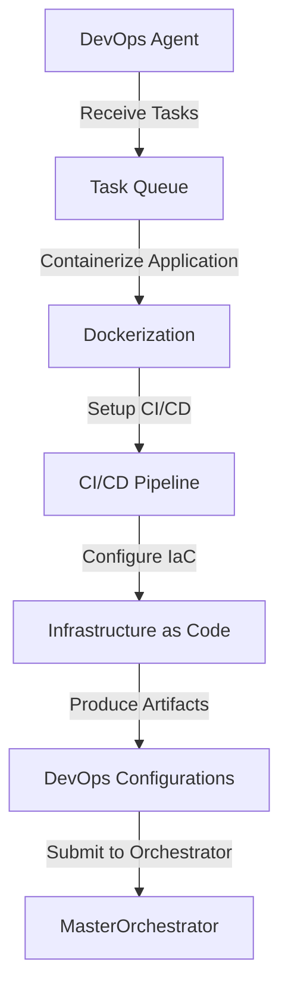

### **Testing Agent Flow**

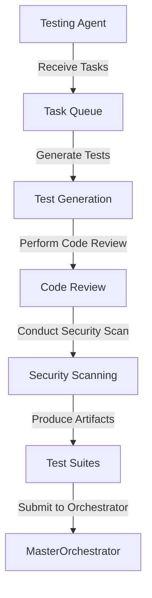

### **Evolution Engine Flow**

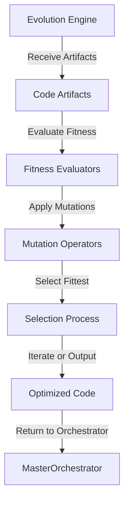

---

## **5. Sequence Diagrams**

### **Overall System Sequence**

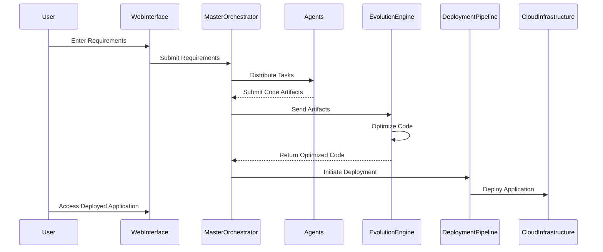

---

## **6. Deployment Architecture**

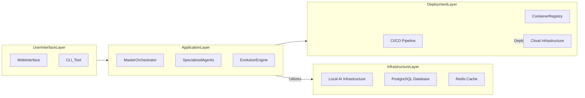

**Notes:**

- **Local AI Infrastructure**: Houses AI models and handles inference locally.
- **Cloud Provider**: Supports deployment targets like AWS, GCP, or Azure.
- **CI/CD Pipeline**: Automates building, testing, and deploying applications.

---

## **7. Data Models**

### **7.1 Requirement Model**

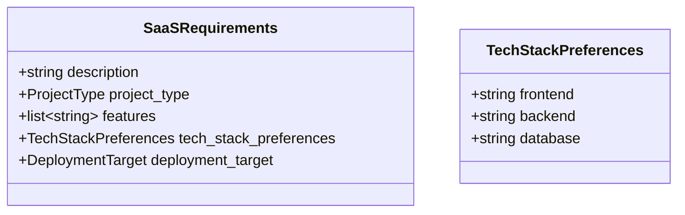

### **7.2 Task Model**

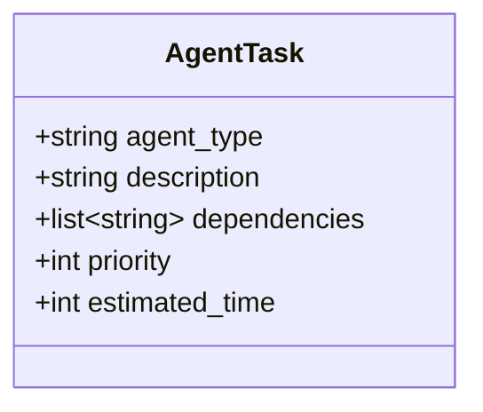

---

## **8. Conclusion**

This design document provides a comprehensive overview of the Agentic AI Full-Stack Tech Company's system architecture, components, data flows, and interactions. The diagrams illustrate both the overall system flow and the detailed operations of each individual component. This should serve as a solid foundation for development, testing, and deployment phases.
