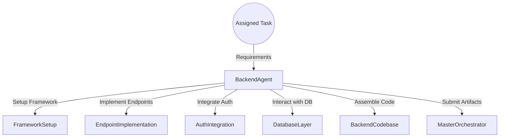
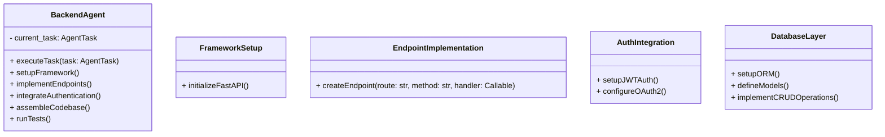
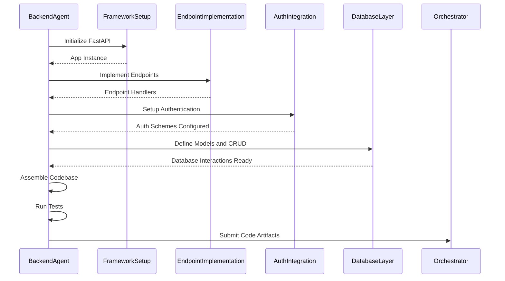

# Backend Agent

## Introduction

The **Backend Agent** is responsible for setting up the backend infrastructure, implementing business logic, and configuring authentication and authorization mechanisms using the specified backend framework.

## Responsibilities

- Set up the backend framework (e.g., FastAPI).
- Implement API endpoints as per requirements.
- Integrate with the database layer.
- Implement authentication and authorization.
- Provide unit and integration tests for backend components.

## Architecture

### High-Level Flow



### Component Diagram



## Detailed Design

### executeTask

- **Input**: `task: AgentTask`
- **Flow**:
  1. Setup the backend framework.
  2. Implement required API endpoints.
  3. Integrate authentication mechanisms.
  4. Interact with the Database Agent for models.
  5. Assemble the backend codebase.
  6. Run unit and integration tests.
  7. Package artifacts for submission.

### FrameworkSetup

- **Function**: Initializes the FastAPI application.
- **Implementation**:
  - Create main application instance.
  - Configure middleware (e.g., CORS).
  - Setup exception handlers.

### EndpointImplementation

- **Function**: Defines API routes and handlers.
- **Implementation**:
  - Use decorators to define HTTP methods.
  - Implement business logic in handler functions.
  - Validate request and response schemas using Pydantic models.

### AuthIntegration

- **Function**: Implements authentication and authorization schemes.
- **Implementation**:
  - Use JWT tokens for stateless authentication.
  - Implement OAuth2 flows if necessary.
  - Protect routes with dependency injection.

### DatabaseLayer

- **Function**: Interacts with the database using an ORM (e.g., SQLAlchemy).
- **Implementation**:
  - Define database models.
  - Create session management.
  - Implement CRUD operations.

## Data Models

### Pydantic Models

- Define request and response schemas using Pydantic for data validation.

```python
from pydantic import BaseModel

class Item(BaseModel):
    id: int
    name: str
    description: Optional[str] = None
    price: float
```

### Database Models

- Define ORM models matching the database schema.

```python
from sqlalchemy import Column, Integer, String, Float
from database import Base

class ItemModel(Base):
    __tablename__ = 'items'
    id = Column(Integer, primary_key=True, index=True)
    name = Column(String, index=True)
    description = Column(String, nullable=True)
    price = Column(Float)
```

## Sequence Diagram



## Error Handling

- **Exception Handling**:
  - Use FastAPI's exception handling to return standardized error responses.
- **Input Validation**:
  - Leverage Pydantic models to validate incoming data.
- **Database Errors**:
  - Handle database connection errors and transaction rollbacks.

## Security Considerations

- **Authentication**:
  - Secure password storage using hashing algorithms (e.g., bcrypt).
  - Implement token expiration and refresh mechanisms.
- **Authorization**:
  - Role-based access control (RBAC) for different user levels.
- **Input Sanitization**:
  - Protect against SQL injection via parameterized queries.
  - Sanitize user inputs to prevent injection attacks.

## Performance Considerations

- **Asynchronous Operations**:
  - Utilize FastAPI's async capabilities for I/O-bound operations.
- **Caching**:
  - Implement caching strategies for frequent read operations.
- **Scalability**:
  - Design stateless services for horizontal scaling.

## Dependencies

- **Python Libraries**:
  - `FastAPI`
  - `Uvicorn` for ASGI server
  - `SQLAlchemy` or `Tortoise ORM`
  - `Pydantic`
  - `aiohttp` for async HTTP requests
- **Database**:
  - PostgreSQL
