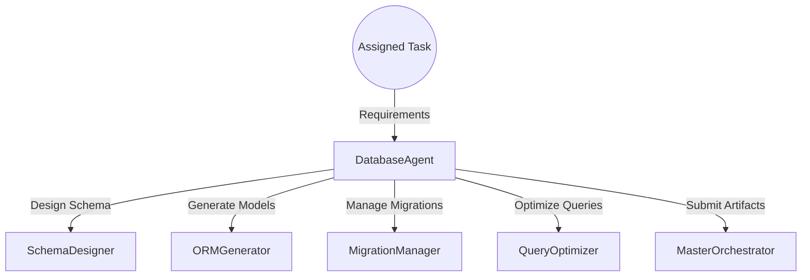
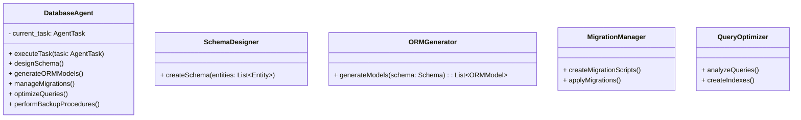
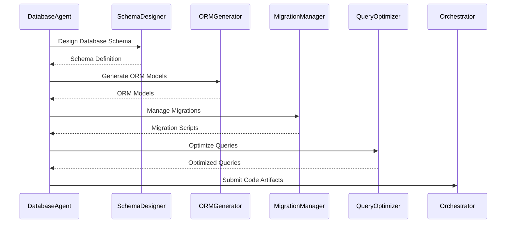

# Database Agent

## Introduction

The **Database Agent** is responsible for designing, optimizing, and managing the database layer of the application. It creates database schemas based on requirements, manages migrations, and ensures efficient and secure data storage and retrieval.

## Responsibilities

- **Schema Design**: Create and optimize database schemas based on application requirements.
- **ORM Integration**: Generate ORM (Object-Relational Mapping) models compatible with the Backend Agent.
- **Migration Management**: Manage database migrations using tools like Alembic.
- **Query Optimization**: Ensure efficient data access through indexing and query optimization.
- **Data Integrity and Security**: Implement constraints and security measures to maintain data integrity.
- **Backup and Recovery**: Define strategies for data backup and recovery.

## Architecture

### High-Level Flow



### Component Diagram



## Detailed Design

### executeTask

- **Input**: `task: AgentTask`
- **Flow**:
    1. Parse task requirements to identify entities and relationships.
    2. Design the database schema using `SchemaDesigner`.
    3. Generate ORM models compatible with the Backend Agent using `ORMGenerator`.
    4. Manage database migrations with `MigrationManager`.
    5. Optimize queries and create indexes using `QueryOptimizer`.
    6. Perform backup and recovery setup.
    7. Package artifacts for submission to the Master Orchestrator.

### SchemaDesigner

- **Function**: Develops the database schema by defining tables, fields, constraints, and relationships.
- **Implementation**:
    - Utilize Entity-Relationship (ER) modeling to represent data structures.
    - Define primary keys, foreign keys, and relationships (one-to-one, one-to-many, many-to-many).
    - Apply normalization techniques to eliminate redundancy.
- **Process**:
    - Identify entities from requirements (e.g., Users, Products, Orders).
    - Define attributes and data types for each entity.
    - Establish relationships and constraints.

### ORMGenerator

- **Function**: Generates ORM models based on the designed schema.
- **Implementation**:
    - Use SQLAlchemy ORM for Python.
    - Map database tables to Python classes.
    - Define relationships and back-references.
- **Example Model**:

```python
from sqlalchemy import Column, Integer, String, ForeignKey
from sqlalchemy.orm import relationship
from base import Base

class User(Base):
    __tablename__ = 'users'
    id = Column(Integer, primary_key=True)
    username = Column(String, unique=True)
    email = Column(String, unique=True)
    orders = relationship('Order', back_populates='user')

class Order(Base):
    __tablename__ = 'orders'
    id = Column(Integer, primary_key=True)
    date = Column(DateTime)
    user_id = Column(Integer, ForeignKey('users.id'))
    user = relationship('User', back_populates='orders')
```

### MigrationManager

- **Function**: Handles database migrations using Alembic.
- **Implementation**:
    - Generate migration scripts based on schema changes.
    - Apply migrations to the database.
    - Maintain migration history.
- **Process**:
    - Initialize Alembic configuration.
    - Auto-generate migration scripts using `alembic revision --autogenerate`.
    - Apply migrations using `alembic upgrade head`.

### QueryOptimizer

- **Function**: Improves database performance by optimizing queries and indexing.
- **Implementation**:
    - Analyze ORM queries for performance bottlenecks.
    - Create indexes on frequently queried columns.
    - Optimize joins and data retrieval strategies.
- **Process**:
    - Use SQLAlchemy's query profiler.
    - Implement indexing strategies.
    - Refactor queries for efficiency.

## Data Models

### Entities and Relationships

- **Entities**: Represented as tables in the database.
    - Examples: `User`, `Order`, `Product`, `Category`.
- **Relationships**:
    - **One-to-Many**: A `User` has many `Orders`.
    - **Many-to-Many**: A `Product` can belong to many `Categories` and vice versa.

### Constraints

- **Primary Keys**: Unique identifiers for each table.
- **Foreign Keys**: Reference relationships between tables.
- **Unique Constraints**: Ensure data uniqueness for specified columns.
- **Check Constraints**: Enforce domain integrity.

## Sequence Diagram



## Error Handling

- **Schema Validation Errors**:
    - Validate schema definitions for consistency.
    - Provide detailed error messages for missing fields or incorrect data types.
- **Migration Conflicts**:
    - Detect conflicts in migration versions.
    - Implement migration conflict resolution strategies.
- **Database Connection Errors**:
    - Handle connection timeouts and authentication failures.
    - Implement retry mechanisms with exponential backoff.

## Security Considerations

- **Access Control**:
    - Implement role-based access control at the database level.
    - Use separate database users with least privilege principles.
- **Data Encryption**:
    - Encrypt sensitive data fields using AES encryption.
    - Implement SSL/TLS for data in transit.
- **Injection Prevention**:
    - Use parameterized queries to prevent SQL injection.
    - Validate and sanitize inputs.

## Performance Considerations

- **Indexing**:
    - Create indexes on columns used in WHERE clauses and join conditions.
    - Use composite indexes when appropriate.
- **Caching**:
    - Implement query caching mechanisms.
    - Utilize Redis for caching frequent queries.
- **Database Scaling**:
    - Plan for horizontal scaling (sharding) and vertical scaling.
    - Implement read replicas if necessary.

## Dependencies

- **Database**:
    - PostgreSQL 13+
- **Python Libraries**:
    - `SQLAlchemy` for ORM
    - `Alembic` for migrations
    - `psycopg2-binary` for PostgreSQL connection
- **Tools**:
    - ER modeling tools (e.g., Draw.io, Lucidchart)
