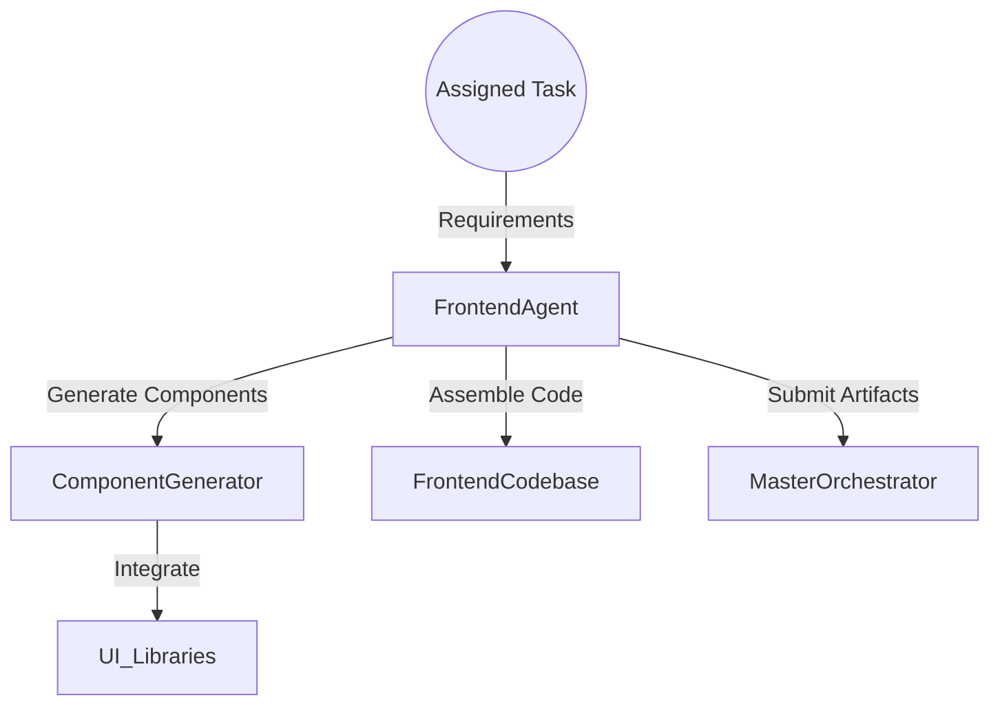
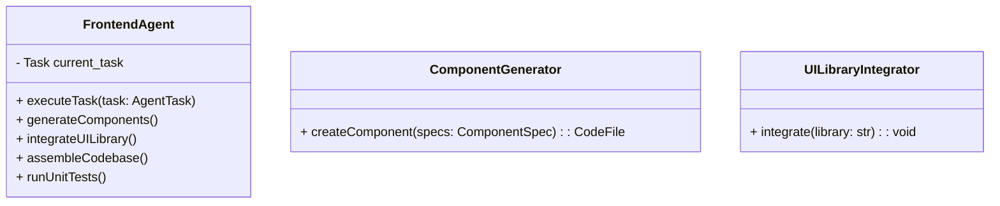
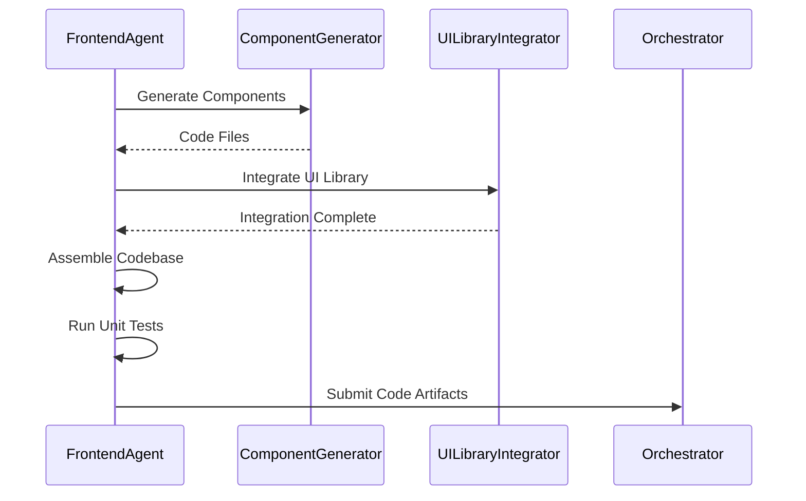

# Frontend Agent

## Introduction

The **Frontend Agent** is responsible for generating the frontend codebase of the application based on the requirements specified. It focuses on creating user interfaces, integrating UI libraries, and ensuring responsive design.

## Responsibilities

- Generate React components using TypeScript.
- Integrate UI libraries (Material-UI or Tailwind CSS).
- Implement routing and navigation.
- Ensure responsiveness and cross-browser compatibility.
- Provide unit tests for frontend components.

## Architecture

### High-Level Flow



### Component Diagram



## Detailed Design

### executeTask

- **Input**: `task: AgentTask`
- **Flow**:
  1. Parse task requirements.
  2. Generate components via `ComponentGenerator`.
  3. Integrate UI libraries using `UILibraryIntegrator`.
  4. Assemble the codebase structure.
  5. Run unit tests to ensure component integrity.
  6. Package artifacts for submission.

### ComponentGenerator

- **Function**: Creates React components based on specifications.
- **Implementation**:
  - Define component templates.
  - Use AST manipulation for code generation.
- **Process**:
  - Receive `ComponentSpec`.
  - Generate TypeScript JSX code.
  - Ensure props and state management are correctly implemented.

### UILibraryIntegrator

- **Function**: Integrates chosen UI library into the project.
- **Implementation**:
  - Modify project configuration files (e.g., `package.json`, webpack configs).
  - Import and use UI components in generated code.
- **Supported Libraries**:
  - Material-UI
  - Tailwind CSS

## Data Models

### ComponentSpec

```typescript
interface ComponentSpec {
  name: string;
  props: Record<string, string>; // propName: propType
  state: Record<string, string>; // stateName: stateType
  events: string[]; // List of event names
  children: ComponentSpec[]; // Nested components
}
```

### CodeFile

```typescript
interface CodeFile {
  path: string;
  content: string;
}
```

## Sequence Diagram



## Error Handling

- **Component Generation Errors**:
  - Validate component specifications before generation.
  - Provide detailed error messages for missing or invalid specs.
- **Library Integration Errors**:
  - Check library compatibility with the project.
  - Handle installation failures gracefully.

## Security Considerations

- **Dependency Management**:
  - Verify the integrity of third-party libraries.
  - Use package lock files to ensure consistent installations.
- **Input Sanitization**:
  - Ensure that any dynamic data rendered in components is sanitized to prevent XSS attacks.

## Performance Considerations

- **Code Optimization**:
  - Implement code splitting and lazy loading.
  - Minify and uglify code for production builds.
- **Asset Optimization**:
  - Optimize images and media assets.
  - Use caching strategies for static content.

## Dependencies

- **Node.js**: Version 18+
- **React**: Version 18
- **TypeScript**: Latest stable version
- **Build Tools**:
  - Webpack
  - Babel
- **Testing Frameworks**:
  - Jest
  - React Testing Library
