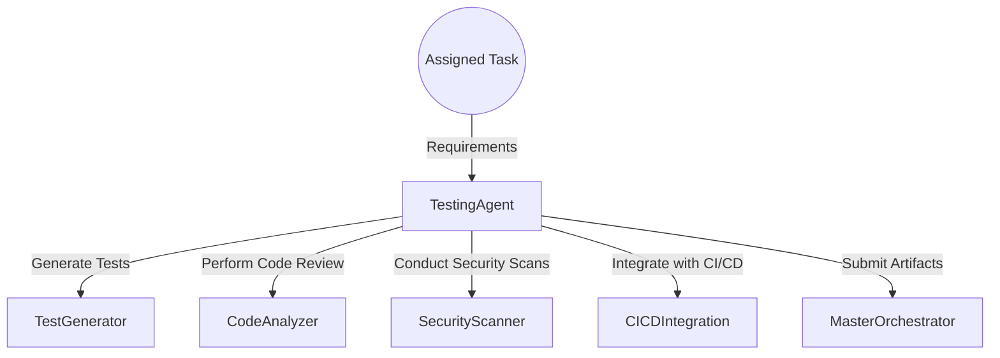
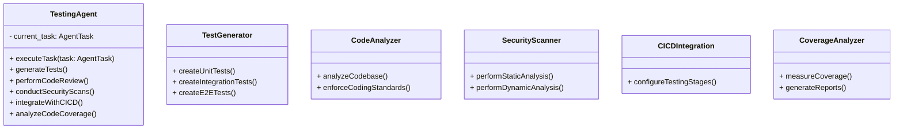
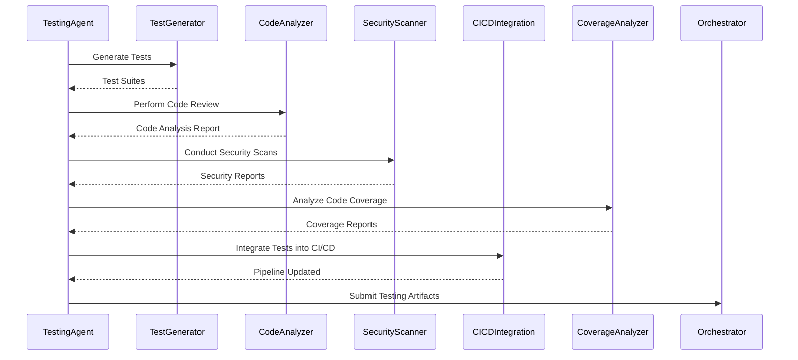

# Testing Agent

## Introduction

The **Testing Agent** is responsible for ensuring the quality and reliability of the codebase by generating comprehensive test suites, performing automated code reviews, and conducting security vulnerability scans.

## Responsibilities

- **Test Generation**: Create unit, integration, and end-to-end tests.
- **Automated Code Review**: Analyze code for adherence to coding standards and detect code smells.
- **Security Scanning**: Perform static and dynamic security analysis.
- **Continuous Testing Integration**: Integrate testing into the CI/CD pipelines.
- **Code Coverage Analysis**: Ensure sufficient test coverage across the codebase.

## Architecture

### High-Level Flow



### Component Diagram



## Detailed Design

### executeTask

- **Input**: `task: AgentTask`
- **Flow**:
    1. Generate test suites using `TestGenerator`.
    2. Perform code analysis using `CodeAnalyzer`.
    3. Conduct security scans with `SecurityScanner`.
    4. Integrate testing stages into CI/CD pipelines with `CICDIntegration`.
    5. Analyze code coverage using `CoverageAnalyzer`.
    6. Package and submit artifacts to the Master Orchestrator.

### TestGenerator

- **Function**: Generates various types of tests.
- **Implementation**:
    - **Unit Tests**: Test individual functions or methods.
        - Use `unittest` or `pytest` for Python, `Jest` for JavaScript.
    - **Integration Tests**: Test interactions between components.
        - Simulate interactions with databases, APIs.
    - **End-to-End Tests**: Simulate user flows through the application.
        - Use tools like `Selenium`, `Cypress`.
- **Example Unit Test in Python**:

```python
import unittest
from src.backend.app import add_numbers

class TestAddition(unittest.TestCase):
    def test_add_numbers(self):
        self.assertEqual(add_numbers(2, 3), 5)

if __name__ == '__main__':
    unittest.main()
```

### CodeAnalyzer

- **Function**: Analyzes code for quality and style.
- **Implementation**:
    - Use linters like `flake8`, `pylint` for Python.
    - Enforce PEP 8 coding standards.
    - Detect code smells and suggest refactoring opportunities.
- **Process**:
    - Scan codebase and generate reports.
    - Highlight issues and recommend fixes.

### SecurityScanner

- **Function**: Identifies security vulnerabilities.
- **Implementation**:
    - **Static Analysis**:
        - Use `Bandit` for Python code security analysis.
        - Scan for common vulnerabilities (e.g., injection, insecure usage of functions).
    - **Dynamic Analysis**:
        - Use `OWASP ZAP` to test running applications.
        - Perform penetration testing and identify exposed endpoints.
- **Process**:
    - Run scans as part of CI/CD pipeline.
    - Generate security reports.

### CICDIntegration

- **Function**: Integrates testing into CI/CD pipelines.
- **Implementation**:
    - Add testing stages to the pipeline configuration.
    - Ensure tests are run automatically on code changes.
    - Configure pipelines to fail on test failures or low code coverage.
- **Example Pipeline Stage**:

```yaml
jobs:
  test:
    runs-on: ubuntu-latest
    steps:
      - uses: actions/checkout@v3
      - name: Set up Python
        uses: actions/setup-python@v4
        with:
          python-version: '3.11'
      - name: Install Dependencies
        run: pip install -r requirements.txt
      - name: Run Tests
        run: pytest --cov=src
      - name: Code Coverage Report
        uses: codecov/codecov-action@v3
```

### CoverageAnalyzer

- **Function**: Measures and reports code coverage.
- **Implementation**:
    - Use `coverage.py` for Python.
    - Generate HTML or XML coverage reports.
    - Set minimum coverage thresholds.
- **Process**:
    - Run coverage analysis during testing.
    - Fail pipeline if coverage is below threshold.
    - Upload reports for analysis.

## Data Models

### Test Cases

- **Attributes**:
    - Test ID
    - Description
    - Preconditions
    - Steps
    - Expected Results
    - Actual Results
    - Status (Pass/Fail)

## Sequence Diagram



## Error Handling

- **Test Failures**:
    - Capture test failure details and stack traces.
    - Provide actionable feedback to developers.
- **Code Analysis Issues**:
    - Identify style violations and coding errors.
    - Enforce coding standards through pipeline enforcement.
- **Security Vulnerabilities**:
    - Prioritize vulnerabilities based on severity.
    - Provide remediation guidance.

## Security Considerations

- **Secure Testing Environments**:
    - Isolate testing environments to prevent unintended side effects.
    - Use mock data instead of real sensitive data.
- **Compliance**:
    - Ensure tests cover compliance requirements.
    - Document test cases for audit purposes.

## Performance Considerations

- **Parallel Testing**:
    - Run tests in parallel to reduce execution time.
- **Test Optimization**:
    - Prioritize critical tests in the pipeline.
    - Use test data management to avoid redundant tests.

## Dependencies

- **Python Libraries**:
    - `pytest`
    - `unittest`
    - `coverage`
    - `flake8`, `pylint` for code linting
    - `bandit` for security analysis
- **JavaScript Libraries**:
    - `Jest`
    - `Cypress` or `Selenium` for E2E tests
- **Tools**:
    - `OWASP ZAP` for dynamic security testing
    - `SonarQube` for code quality analysis
