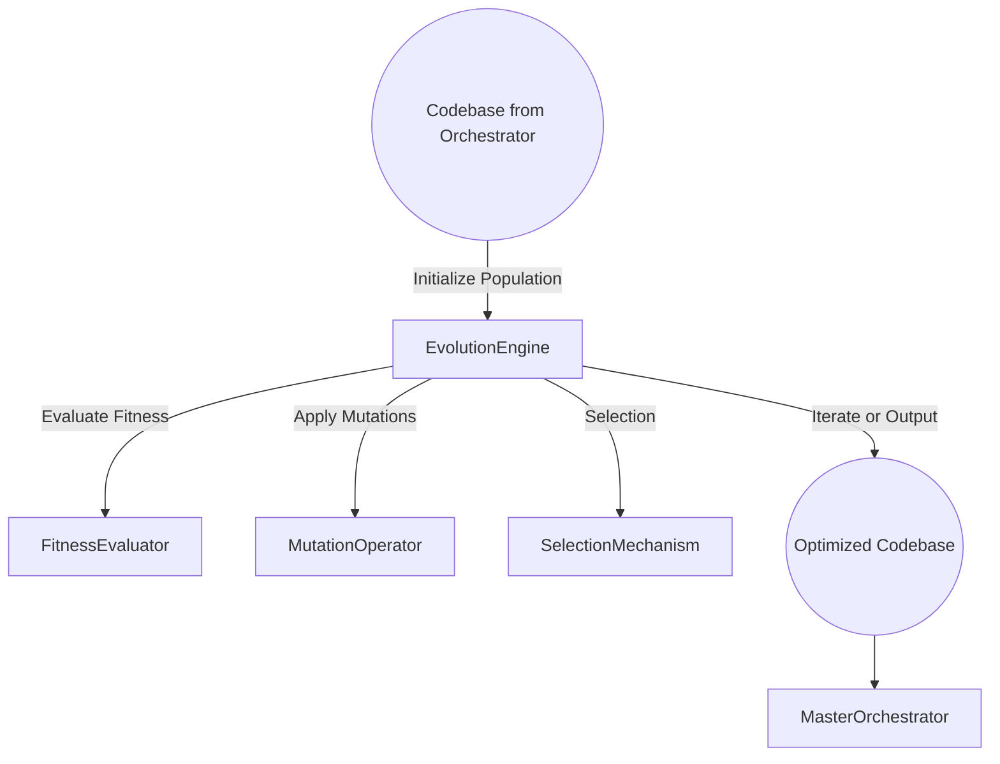
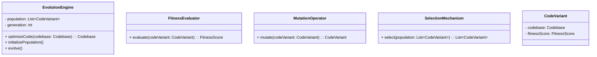
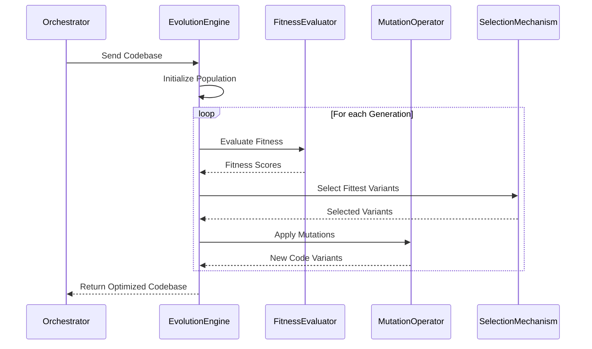

# Evolution Engine

## Introduction

The **Evolution Engine** is responsible for optimizing the generated codebase using evolutionary algorithms. It applies fitness evaluators, mutation operators, and selection mechanisms to improve code quality with respect to performance, security, maintainability, and test coverage.

## Responsibilities

- **Code Optimization**: Enhance the codebase by applying evolutionary techniques.
- **Fitness Evaluation**: Assess code variants based on defined metrics.
- **Mutation Operations**: Apply transformations to code to introduce variations.
- **Selection Mechanism**: Choose the most optimal code variants for further evolution.
- **Integration with Orchestrator**: Interact seamlessly with the Master Orchestrator for input and output.

## Architecture

### High-Level Flow



### Component Diagram



## Detailed Design

### optimizeCode Method

- **Input**: `codebase: Codebase`
- **Flow**:
  1. **Initialize Population**: Generate an initial population of code variants.
  2. **Evolution Loop**:
     - Evaluate fitness of each variant using `FitnessEvaluator`.
     - Select the fittest variants using `SelectionMechanism`.
     - Apply mutations using `MutationOperator` to create a new generation.
     - Repeat for a predefined number of generations or until convergence.
  3. **Output**: Return the most optimal code variant to the Master Orchestrator.

### FitnessEvaluator

- **Function**: Assigns a fitness score to each code variant based on evaluation metrics.
- **Evaluation Metrics**:
  - **Performance**: Execution time, memory usage.
  - **Security**: Number of vulnerabilities detected.
  - **Maintainability**: Code complexity, readability.
  - **Test Coverage**: Percentage of code covered by tests.
- **Implementation**:
  - Use static analysis tools (e.g., SonarQube) for code quality metrics.
  - Use profiling tools for performance metrics.
  - Use security scanners (e.g., Bandit) for vulnerability assessment.
  - Integrate coverage tools (e.g., `coverage.py`) for test coverage.

### MutationOperator

- **Function**: Applies mutations to code variants to explore new solutions.
- **Mutation Types**:
  - **Code Refactoring**: Simplify code structures without changing functionality.
  - **Optimization Mutations**: Enhance performance (e.g., algorithm improvements).
  - **Security Enhancements**: Apply secure coding practices.
  - **Dead Code Elimination**: Remove unnecessary code segments.
- **Implementation**:
  - Use Abstract Syntax Tree (AST) manipulation for code transformations.
  - Ensure mutations maintain syntactic and semantic correctness.
- **Example Mutation**:

```python
# Before Mutation
def compute(values):
    result = 0
    for i in range(len(values)):
        result += values[i]
    return result

# After Mutation (Using built-in sum function)
def compute(values):
    return sum(values)
```

### SelectionMechanism

- **Function**: Selects the fittest code variants for the next generation.
- **Selection Strategies**:
  - **Roulette Wheel Selection**: Probabilistic selection based on fitness scores.
  - **Tournament Selection**: Randomly select a subset and choose the best.
  - **Elitism**: Always carry forward the best-performing variants.
- **Implementation**:
  - Normalize fitness scores.
  - Implement selection algorithms to choose parents for next generation.

### CodeVariant

- **Attributes**:
  - `codebase: Codebase`
  - `fitnessScore: FitnessScore`
- **Function**: Represents an individual code variant within the population.

## Data Models

### Codebase

- Represents the entire code structure of the application.
- Contains all source files and configurations.

### FitnessScore

- **Attributes**:
  - `performanceScore: float`
  - `securityScore: float`
  - `maintainabilityScore: float`
  - `testCoverageScore: float`
  - `totalScore: float`
- **Calculation**: The total score is a weighted sum of individual scores.

## Sequence Diagram



## Error Handling

- **Syntax Errors**:
  - Validate code after mutations to ensure it compiles.
  - Discard variants with syntax errors.
- **Infinite Loops or Timeouts**:
  - Set execution time limits during fitness evaluation.
  - Terminate evaluation if time limit is exceeded.
- **Invalid Mutations**:
  - Ensure mutations do not alter expected functionality (use test suites for validation).
  - Revert or discard invalid variants.

## Security Considerations

- **Secure Coding Practices**:
  - Ensure mutations do not introduce vulnerabilities.
  - Incorporate security checks in fitness evaluation.
- **Data Privacy**:
  - Do not expose sensitive data during optimization.
- **Sandbox Execution**:
  - Run code evaluations in isolated environments to prevent unwanted side effects.

## Performance Considerations

- **Parallel Processing**:
  - Distribute fitness evaluations across multiple cores or machines.
  - Use concurrent processing to handle large populations.
- **Caching**:
  - Cache fitness scores of identical code variants to avoid redundant evaluations.
- **Generation Limits**:
  - Limit the number of generations to balance optimization and resource usage.

## Dependencies

- **Programming Language**: Python 3.11+
- **Libraries**:
  - `ast` for code parsing and manipulation.
  - `multiprocessing` or `asyncio` for parallelism.
- **Tools**:
  - **Static Analysis**: `pylint`, `flake8`
  - **Code Quality**: `SonarQube`, `CodeClimate`
  - **Security Scanning**: `Bandit`
  - **Performance Profiling**: `cProfile`, `line_profiler`
