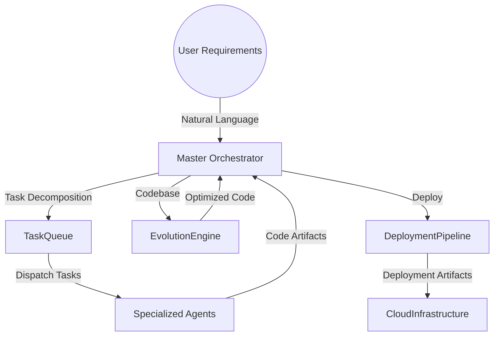
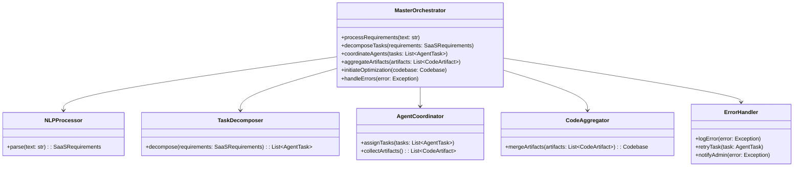
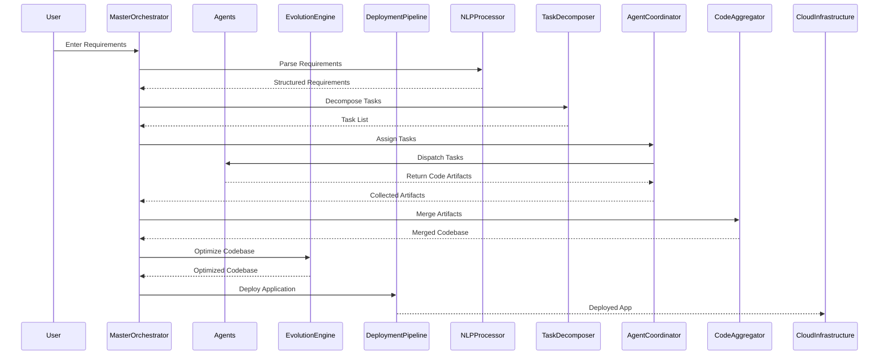

# Master Orchestrator

## Introduction

The **Master Orchestrator** is the central component responsible for coordinating the entire system. It processes natural language requirements, decomposes them into actionable tasks, assigns tasks to specialized agents, aggregates the outputs, and oversees the optimization and deployment processes.

## Responsibilities

- **Requirement Parsing**: Interpret natural language requirements using NLP techniques.
- **Task Decomposition**: Break down requirements into discrete, manageable tasks.
- **Agent Coordination**: Assign tasks to appropriate specialized agents and manage their execution.
- **Artifact Aggregation**: Collect and integrate code artifacts from agents.
- **Optimization Initiation**: Trigger the Evolution Engine for code optimization.
- **Error Handling**: Manage exceptions and failures in the workflow.

## Architecture

### High-Level Architecture Diagram



### Component Interaction



## Detailed Design

### processRequirements

This method accepts a natural language input and orchestrates the entire workflow.

- **Input**: `text: str`
- **Flow**:
  1. Parse requirements using `NLPProcessor`.
  2. Decompose tasks using `TaskDecomposer`.
  3. Coordinate agents via `AgentCoordinator`.
  4. Aggregate code artifacts using `CodeAggregator`.
  5. Initiate optimization with `EvolutionEngine`.
  6. Handle deployment via `DeploymentPipeline`.
- **Exceptions**: Handles exceptions through `ErrorHandler`.

### NLPProcessor

- **Function**: Parses natural language text to extract structured requirements.
- **Implementation**:
  - Use spaCy for entity recognition and dependency parsing.
  - Identify key features, project type, and technology preferences.
- **Algorithm**:
  - Text Preprocessing (tokenization, lemmatization).
  - Named Entity Recognition (NER) to extract features.
  - Dependency Parsing to understand relationships.

### TaskDecomposer

- **Function**: Transforms structured requirements into specific tasks with dependencies.
- **Implementation**:
  - Define task templates for different project types.
  - Map features to agent capabilities.
- **Algorithm**:
  - Requirement mapping to task domains.
  - Dependency graph construction.

### AgentCoordinator

- **Function**: Manages task assignment and monitors agent execution.
- **Implementation**:
  - Use asyncio for asynchronous task handling.
  - Maintain task queues and agent availability status.
- **Data Structures**:
  - `agent_registry`: Mapping of agent types to instance endpoints.
  - `task_queue`: Priority queue based on task priority.

### CodeAggregator

- **Function**: Merges code artifacts from different agents into a cohesive codebase.
- **Implementation**:
  - Use Git for version control and merging.
  - Resolve conflicts and ensure code compatibility.
- **Process**:
  - Clone initial repository template.
  - Apply patches or code segments from agents.
  - Run syntax and type checks.

### ErrorHandler

- **Function**: Centralized error management.
- **Implementation**:
  - Log errors with contextual information.
  - Implement retry mechanisms with exponential backoff.
  - Send alerts for critical failures.

## Data Models

### SaaSRequirements

```python
class SaaSRequirements:
    description: str
    project_type: ProjectType
    features: List[str]
    tech_stack_preferences: TechStackPreferences
    deployment_target: DeploymentTarget

class TechStackPreferences:
    frontend: str
    backend: str
    database: str
```

### AgentTask

```python
class AgentTask:
    agent_type: str
    description: str
    dependencies: List[str]
    priority: int
    estimated_time: int
```

### CodeArtifact

```python
class CodeArtifact:
    agent_type: str
    files: Dict[str, str]  # Mapping of file paths to content
    dependencies: List[str]
    metadata: Dict[str, Any]
```

## Sequence Diagram



## Error Handling

- **Logging**: Use structured logging with context (e.g., task ID, agent type).
- **Retry Logic**: Implement retries for transient errors (network issues, timeouts).
- **Fallback Mechanisms**: If an agent fails, reassign the task or use default implementations.
- **Notifications**: Integrate with alerting systems (e.g., Slack, Email) for critical failures.

## Security Considerations

- **Authentication**: Use OAuth 2.0 for secure agent communication.
- **Authorization**: Role-based access control to ensure agents only access authorized resources.
- **Data Encryption**: Use TLS/SSL for data in transit; AES encryption for data at rest.
- **Input Validation**: Sanitize user inputs to prevent injection attacks.

## Performance Considerations

- **Asynchronous Operations**: Leverage asyncio to handle concurrent agent tasks.
- **Caching**: Cache intermediate results to optimize performance.
- **Resource Management**: Monitor CPU and memory usage to prevent bottlenecks.

## Dependencies

- **Python Libraries**:
  - `asyncio`
  - `spaCy` or `NLTK`
  - `GitPython` for version control operations
  - `requests` for HTTP communication
- **External Services**:
  - **Messaging Queue**: RabbitMQ or Redis
  - **Local AI Models**: Accessed via LocalAI API
