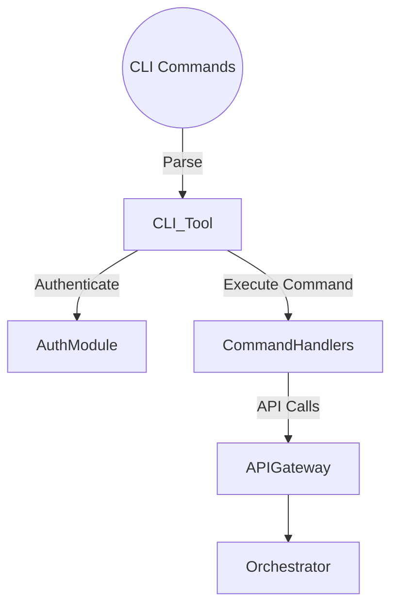
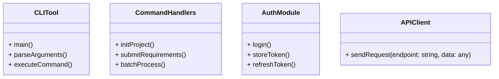
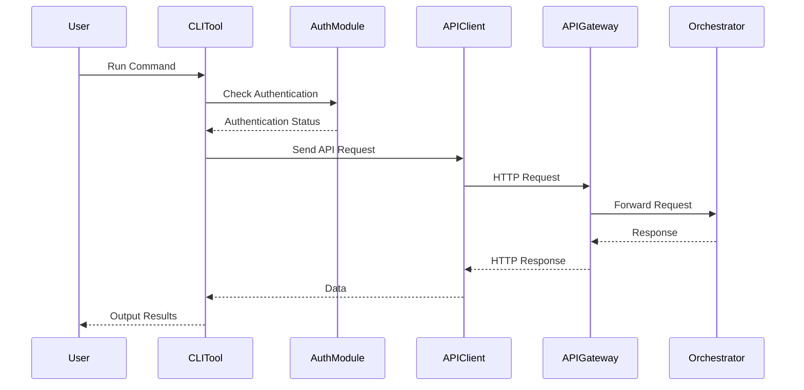

# CLI Tool

## Introduction

The **Command-Line Interface (CLI) Tool** allows power users and developers to interact with the system via the command line. It supports project setup, requirement specification, batch processing, and integrates with the Master Orchestrator through APIs.

## Responsibilities

- **Project Initialization**: Create and scaffold new projects.
- **Requirement Specification**: Input project requirements in a structured manner.
- **Batch Processing**: Process multiple projects or configurations in batch mode.
- **Integration with Orchestrator**: Communicate with backend services via APIs.
- **User Authentication**: Handle authentication for secure operations.
- **Ease of Use**: Provide intuitive commands and help documentation.

## Architecture

### High-Level Flow



### Component Diagram



## Detailed Design

### Technology Stack

- **Programming Language**: Python 3.11+
- **Packaging**: Use `argparse` or `click` library for command parsing.
- **HTTP Requests**: Use `requests` library for API communication.
- **JSON Handling**: Use `json` module for data serialization.

### Core Functions

#### Project Initialization

- **Command**: `cli-tool init [project-name]`
- **Features**:
  - Create a new project directory.
  - Generate necessary configuration files.
- **Implementation**:
  - Use templates for configuration files.
  - Handle naming conflicts.

#### Requirement Specification

- **Command**: `cli-tool submit-requirements [options]`
- **Features**:
  - Accept requirements via command-line options or input files.
  - Validate and serialize requirements.
- **Implementation**:
  - Use `argparse` for option parsing.
  - Support JSON or YAML input files.

#### Batch Processing

- **Command**: `cli-tool batch-process [file]`
- **Features**:
  - Process multiple projects defined in a file.
  - Support parallel processing.
- **Implementation**:
  - Read batch files and iterate over entries.
  - Optionally use multithreading.

#### Authentication

- **Commands**:
  - `cli-tool login`
  - `cli-tool logout`
- **Features**:
  - Prompt user for credentials.
  - Store tokens securely (e.g., using keyring or OS credential store).
- **Implementation**:
  - Use `getpass` for password input.
  - Securely store and retrieve tokens.

#### Help and Documentation

- **Command**: `cli-tool --help` or `cli-tool [command] --help`
- **Features**:
  - Provide usage instructions.
  - Explain available commands and options.
- **Implementation**:
  - Use docstrings and `argparse` help formatter.

## Data Models

### Configuration File

```yaml
project:
  name: "my_project"
  description: "A sample project"
requirements:
  projectType: "FULL_STACK"
  features:
    - "User authentication"
    - "Task management"
  techStackPreferences:
    frontend: "React with TypeScript"
    backend: "FastAPI"
    database: "PostgreSQL"
  deploymentTarget: "DOCKER"
```

### Command-Line Options

- **Global Options**:
  - `--verbose`: Enable verbose output.
  - `--config`: Specify custom configuration file.
- **Authentication Options**:
  - `--username`
  - `--password`

## Sequence Diagram



## Error Handling

- **Invalid Commands**:
  - Display helpful error messages.
  - Suggest valid commands.
- **Network Errors**:
  - Handle timeouts and connection issues.
  - Retry mechanism for transient errors.
- **Authentication Failures**:
  - Prompt user to re-authenticate.
  - Provide reasons for failure.

## Security Considerations

- **Secure Storage**:
  - Avoid storing passwords in plain text.
  - Use OS-specific credential stores.
- **Input Validation**:
  - Validate all inputs before processing.
- **Dependency Management**:
  - Use virtual environments to isolate dependencies.
  - Regularly update packages to patch vulnerabilities.

## Performance Considerations

- **Parallel Processing**:
  - Use multithreading or asyncio for batch operations.
- **Logging**:
  - Provide logging levels (INFO, DEBUG, ERROR).
  - Optionally log to files for auditing.

## Dependencies

- **Python Libraries**:
  - `argparse` or `click` for CLI parsing
  - `requests` for HTTP requests
  - `json`, `yaml` for configuration files
  - `keyring` for secure credential storage
- **Packaging Tools**:
  - `setuptools` or `poetry` for packaging and distribution
- **Optional Tools**:
  - `pytest` for testing the CLI tool
  - `sphinx` for generating documentation
