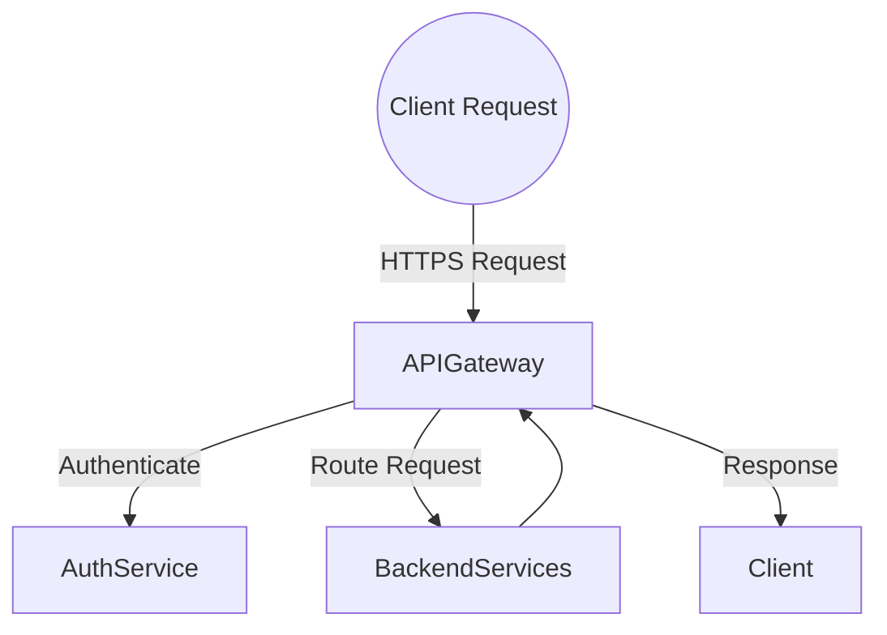
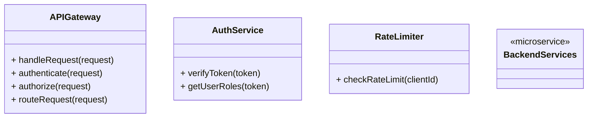
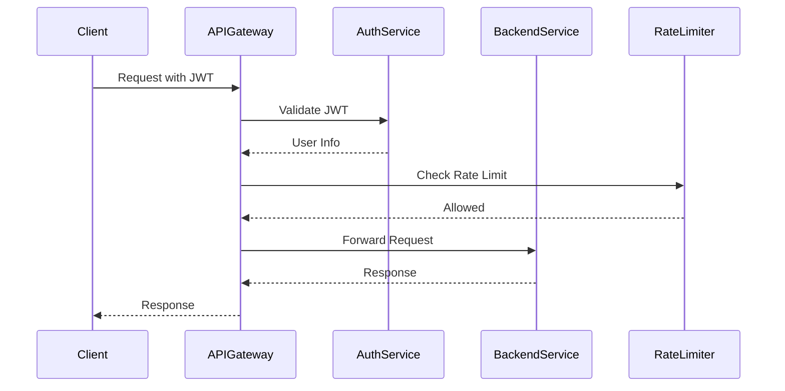

# API Gateway

## Introduction

The **API Gateway** serves as the single entry point for all client requests to the backend services. It handles request routing, authentication, rate limiting, and acts as a reverse proxy. The gateway abstracts the complexity of the underlying microservices architecture from the clients.

## Responsibilities

- **Request Routing**: Forward client requests to appropriate backend services.
- **Authentication and Authorization**: Verify client credentials and enforce access control.
- **Rate Limiting**: Protect backend services from excessive requests.
- **Load Balancing**: Distribute requests among multiple service instances.
- **API Aggregation**: Combine responses from multiple services when necessary.
- **Monitoring and Logging**: Collect metrics and logs for monitoring.

## Architecture

### High-Level Flow



### Component Diagram



## Detailed Design

### Technology Stack

- **Gateway Framework**: Node.js with Express.js or Fastify
- **Authentication**: JWT validation middleware
- **Secure Communication**: HTTPS with SSL/TLS
- **Reverse Proxy**: Nginx or HAProxy (optional)
- **API Documentation**: OpenAPI (Swagger)

### Core Functions

#### Authentication and Authorization

- **Implementation**:
  - Use JWT tokens for stateless authentication.
  - Implement middleware to validate tokens.
  - Extract user roles and permissions from token claims.
  - Enforce access control based on roles.

#### Request Routing

- **Implementation**:
  - Define route mappings to backend services.
  - Use dynamic routing when necessary.
  - Handle URI parameters and query strings appropriately.

#### Rate Limiting

- **Implementation**:
  - Use in-memory stores like Redis for tracking request counts.
  - Implement algorithms like Token Bucket or Leaky Bucket.
  - Customize rate limits per API key or IP address.

#### Load Balancing

- **Implementation**:
  - Use round-robin or least connections strategies.
  - Integrate with service discovery mechanisms if using container orchestration (e.g., Kubernetes).

#### Monitoring and Logging

- **Implementation**:
  - Use logging libraries like `winston`.
  - Collect metrics (e.g., request counts, response times) using tools like Prometheus.
  - Set up alerts for error rates and performance issues.

### Security

- **Input Validation**:
  - Sanitize request inputs to prevent injection attacks.
- **HTTPS Enforcement**:
  - Redirect HTTP requests to HTTPS.
  - Use strong cipher suites.
- **CORS Configuration**:
  - Configure Cross-Origin Resource Sharing policies.
- **API Keys**:
  - Provide API keys for third-party integrations.
  - Securely store and manage API keys.

## Data Models

### API Request

```typescript
interface APIRequest {
  method: string;
  path: string;
  headers: Record<string, string>;
  queryParams: Record<string, string>;
  body: any;
}
```

### Auth Token

```typescript
interface AuthToken {
  sub: string; // Subject (user identifier)
  exp: number; // Expiration time
  roles: string[]; // User roles
  permissions: string[]; // Specific permissions
}
```

## Sequence Diagram



## Error Handling

- **Authentication Failures**:
  - Return `401 Unauthorized` status code.
  - Provide error messages without revealing sensitive details.
- **Authorization Errors**:
  - Return `403 Forbidden` status code.
- **Rate Limit Exceeded**:
  - Return `429 Too Many Requests` status code.
  - Include `Retry-After` header specifying when to retry.
- **Service Unavailable**:
  - Handle backend service failures gracefully.
  - Return `503 Service Unavailable` status code.

## Security Considerations

- **API Throttling**:
  - Prevent abuse and DoS attacks by limiting request rates.
- **Input Sanitization**:
  - Prevent injection attacks by validating all inputs.
- **Logging Sensitive Data**:
  - Avoid logging sensitive information (e.g., passwords, tokens).
- **Penetration Testing**:
  - Regularly perform security assessments.

## Performance Considerations

- **Caching**:
  - Implement response caching for idempotent GET requests.
  - Use HTTP cache headers (`ETag`, `Cache-Control`).
- **Asynchronous Processing**:
  - Support asynchronous request handling where appropriate.
- **Resource Optimization**:
  - Optimize memory usage and avoid blocking the event loop.

## Dependencies

- **Node.js Packages**:
  - `express` or `fastify` for server framework
  - `jsonwebtoken` for JWT handling
  - `express-rate-limit` or custom rate limiter
  - `helmet` for security headers
- **External Services**:
  - AuthService for user authentication
  - Redis for rate limiting state
- **API Documentation**:
  - `swagger-ui-express` for API docs
