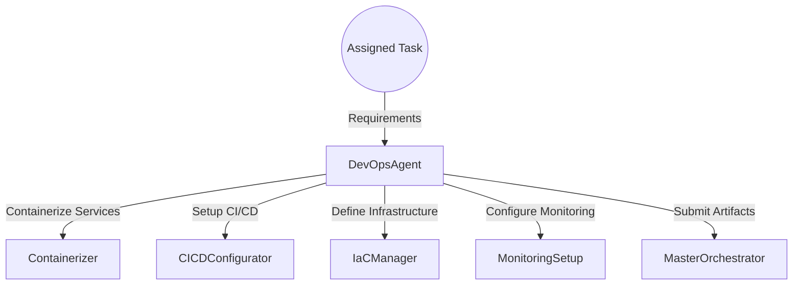
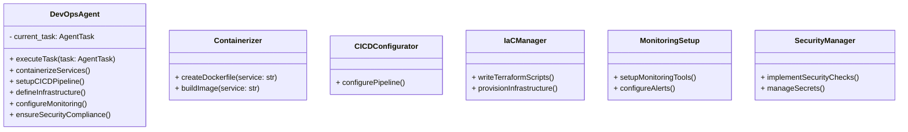
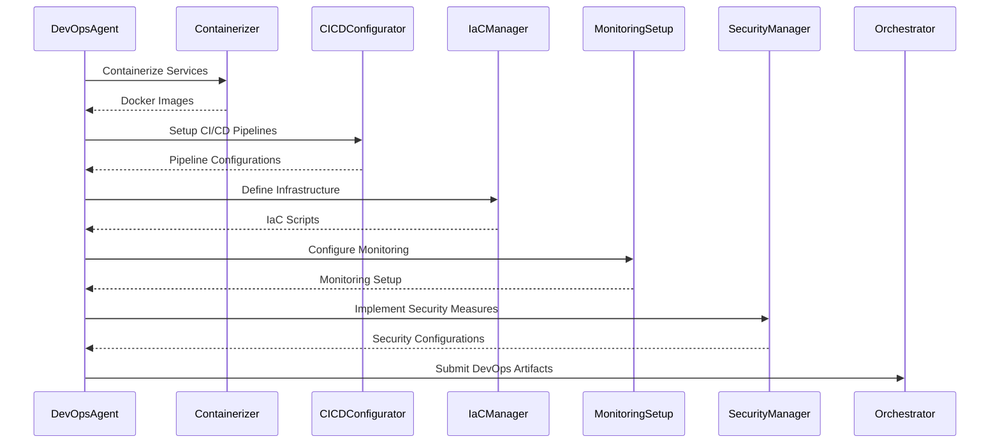

# DevOps Agent

## Introduction

The **DevOps Agent** is responsible for automating the deployment and infrastructure management of the entire application. It handles containerization, CI/CD pipeline setup, infrastructure as code, monitoring, and logging configurations.

## Responsibilities

- **Containerization**: Create Dockerfiles and containerize application services.
- **CI/CD Pipeline Setup**: Configure automated build, test, and deployment pipelines.
- **Infrastructure as Code (IaC)**: Define cloud infrastructure using tools like Terraform.
- **Environment Provisioning**: Automate the setup of development, staging, and production environments.
- **Monitoring and Logging**: Configure monitoring tools and centralized logging.
- **Security and Compliance**: Implement security best practices in DevOps processes.

## Architecture

### High-Level Flow



### Component Diagram



## Detailed Design

### executeTask

- **Input**: `task: AgentTask`
- **Flow**:
    1. Containerize application services using `Containerizer`.
    2. Set up CI/CD pipelines with `CICDConfigurator`.
    3. Define infrastructure requirements in code using `IaCManager`.
    4. Configure monitoring and logging with `MonitoringSetup`.
    5. Implement security measures with `SecurityManager`.
    6. Package and submit artifacts to the Master Orchestrator.

### Containerizer

- **Function**: Creates Docker images for each application service.
- **Implementation**:
    - Write Dockerfiles with multi-stage builds for optimization.
    - Use appropriate base images (e.g., `python:3.11-slim`, `node:18-alpine`).
    - Build and tag Docker images.
- **Example Dockerfile**:

```Dockerfile
# Stage 1: Build Stage
FROM node:18-alpine AS builder
WORKDIR /app
COPY package.json package-lock.json ./
RUN npm install
COPY . .
RUN npm run build

# Stage 2: Production Stage
FROM nginx:alpine
COPY --from=builder /app/build /usr/share/nginx/html
EXPOSE 80
CMD ["nginx", "-g", "daemon off;"]
```

### CICDConfigurator

- **Function**: Sets up continuous integration and continuous deployment pipelines.
- **Implementation**:
    - Configure pipelines using GitHub Actions or GitLab CI/CD.
    - Define stages: build, test, deploy.
    - Include automated testing and code analysis in the pipeline.
- **Example GitHub Actions Workflow**:

```yaml
name: CI/CD Pipeline

on:
  push:
    branches: [ main ]

jobs:
  build:
    runs-on: ubuntu-latest
    steps:
      - uses: actions/checkout@v3
      - name: Set up Node.js
        uses: actions/setup-node@v3
        with:
          node-version: 18
      - name: Install Dependencies
        run: npm install
      - name: Run Tests
        run: npm test
      - name: Build
        run: npm run build
      - name: Build Docker Image
        run: docker build -t myapp:latest .
      - name: Push Docker Image
        run: docker push myregistry/myapp:latest
```

### IaCManager

- **Function**: Defines infrastructure resources using Terraform.
- **Implementation**:
    - Write `*.tf` files to define resources (e.g., EC2 instances, S3 buckets).
    - Use Terraform modules for reusable components.
    - Manage state files securely.
- **Example Terraform Configuration**:

```hcl
provider "aws" {
  region = "us-east-1"
}

resource "aws_ecs_cluster" "app_cluster" {
  name = "my-app-cluster"
}

module "vpc" {
  source = "terraform-aws-modules/vpc/aws"
  name   = "my-vpc"
  cidr   = "10.0.0.0/16"
}
```

### MonitoringSetup

- **Function**: Configures monitoring and logging for the application.
- **Implementation**:
    - Set up Prometheus and Grafana for monitoring.
    - Use ELK Stack (Elasticsearch, Logstash, Kibana) or EFK (Elasticsearch, Fluentd, Kibana) for logging.
    - Define alert thresholds and notifications.
- **Process**:
    - Install monitoring agents on servers.
    - Configure dashboards and visualizations.
    - Integrate with alerting systems (e.g., PagerDuty, Slack).

### SecurityManager

- **Function**: Implements security best practices in DevOps processes.
- **Implementation**:
    - Use tools like `Trivy` for container scanning.
    - Implement secret management using AWS Secrets Manager or HashiCorp Vault.
    - Enforce security policies in pipelines.
- **Process**:
    - Scan images for vulnerabilities before deployment.
    - Rotate secrets and credentials regularly.
    - Audit logs for suspicious activities.

## Sequence Diagram



## Error Handling

- **Build Failures**:
    - Detect build errors in Dockerfile stages.
    - Provide meaningful error logs.
- **Pipeline Failures**:
    - Implement retry strategies for transient errors.
    - Notify stakeholders on failures.
- **Infrastructure Provisioning Errors**:
    - Handle Terraform errors and state conflicts.
    - Roll back changes on failure.

## Security Considerations

- **Secure Docker Images**:
    - Use minimal base images to reduce the attack surface.
    - Regularly update images to patch vulnerabilities.
- **Pipeline Security**:
    - Use least privilege IAM roles for pipeline execution.
    - Store secrets securely and avoid hardcoding.
- **Infrastructure Security**:
    - Implement security groups and network ACLs.
    - Enable encryption at rest and in transit.

## Performance Considerations

- **Scalable Infrastructure**:
    - Use auto-scaling groups for dynamic scaling.
    - Leverage container orchestration (e.g., Kubernetes).
- **Optimized Builds**:
    - Cache dependencies to speed up builds.
    - Parallelize pipeline stages where possible.
- **Resource Monitoring**:
    - Monitor resource utilization to optimize costs.

## Dependencies

- **Tools**:
    - Docker
    - Terraform
    - GitHub Actions or GitLab CI/CD
    - Prometheus and Grafana
    - ELK Stack or EFK Stack
- **Cloud Providers**:
    - AWS, GCP, or Azure

## Compliance Standards

- **Compliance**:
    - Ensure compliance with standards like SOC 2, GDPR.
    - Implement auditing and logging mechanisms.
    - Regularly perform security assessments.
