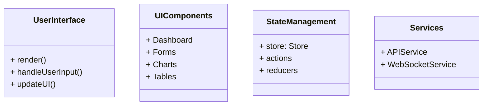
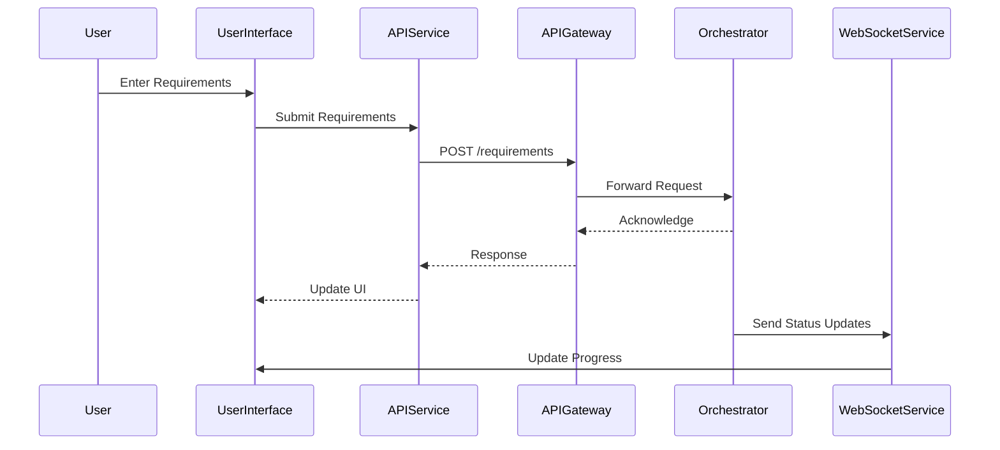

# User Interface

## Introduction

The **User Interface (UI)** component provides an interactive platform for users to interact with the system. It includes a web-based dashboard and possibly other client interfaces. The UI allows users to input requirements, monitor project progress, manage deployments, and receive notifications.

## Responsibilities

- **Requirement Input**: Allow users to enter and edit project requirements.
- **Project Monitoring**: Display real-time status updates and progress visualizations.
- **Deployment Management**: Provide controls for initiating and managing deployments.
- **User Authentication and Authorization**: Secure access to the application.
- **Responsive Design**: Ensure usability across various devices and screen sizes.

## Architecture

### High-Level Flow

```mermaid
flowchart TD
    User -->|Access via Browser| UserInterface
    UserInterface -->|Submit Requirements| MasterOrchestrator
    UserInterface <--|Receive Updates| WebSockets
    UserInterface -->|Display Data| UIComponents
    UserInterface -->|Trigger Actions| APIGateway
```

### Component Diagram



## Detailed Design

### Technology Stack

- **Frontend Framework**: React 18 with TypeScript
- **UI Library**: Material-UI (MUI) or Tailwind CSS
- **State Management**: Redux Toolkit or Zustand
- **Real-time Communication**: WebSockets (e.g., Socket.IO)
- **Build Tools**: Webpack, Babel

### Core Functions

#### Requirement Input

- **Features**:
  - Interactive forms for entering project requirements.
  - Validation of input fields.
  - Ability to save and load requirement presets.
- **Implementation**:
  - Use controlled components in React for form fields.
  - Implement validation using libraries like `Formik` and `Yup`.
  - Modularize form components for reusability.

#### Project Monitoring

- **Features**:
  - Display status updates, progress bars, and logs.
  - Visualize data using charts (e.g., Gantt charts).
- **Implementation**:
  - Use charting libraries like `Recharts` or `Chart.js`.
  - Real-time updates via WebSockets.
  - Organize data visualization components for scalability.

#### Deployment Management

- **Features**:
  - Buttons and controls to initiate deployments.
  - Display deployment statuses and history.
- **Implementation**:
  - Integrate with API Gateway for backend communication.
  - Use modals and confirmation dialogs for critical actions.

### Routing and Navigation

- **Implementation**:
  - Use `React Router` for client-side routing.
  - Define routes for different application views (e.g., `/dashboard`, `/projects`, `/settings`).

### State Management

- **Implementation**:
  - Use **Redux Toolkit** for predictable state management.
  - Organize slices for different data domains (e.g., user, projects, notifications).
  - Implement asynchronous actions with `Redux Thunk` or `Redux Saga`.

### Services

- **APIService**:
  - Handles HTTP requests to the backend via the API Gateway.
  - Use `axios` or Fetch API for requests.
- **WebSocketService**:
  - Establishes and manages WebSocket connections.
  - Listens for events and dispatches actions to update the UI.

### Security

- **Authentication**:
  - Implement authentication flows (e.g., login, logout).
  - Use JSON Web Tokens (JWT) for session management.
- **Authorization**:
  - Control access to routes and components based on user roles.
- **Input Sanitization**:
  - Prevent XSS attacks by sanitizing user inputs and outputs.
- **Implementation**:
  - Use libraries like `jwt-decode` to handle tokens.
  - Securely store tokens (use HttpOnly cookies when possible).

## Data Models

### User

```typescript
interface User {
  id: string;
  username: string;
  email: string;
  role: string; // e.g., 'admin', 'user'
  token: string;
}
```

### Project

```typescript
interface Project {
  id: string;
  name: string;
  status: string;
  requirements: Requirements;
  progress: number; // 0 to 100
}
```

### Requirements

```typescript
interface Requirements {
  description: string;
  projectType: string;
  features: string[];
  techStackPreferences: TechStackPreferences;
  deploymentTarget: string;
}
```

## Sequence Diagram



## Error Handling

- **Network Errors**:
  - Implement global error handlers.
  - Display user-friendly error messages.
- **Form Validation Errors**:
  - Provide inline validation feedback.
  - Prevent form submission until all validations pass.
- **Authentication Errors**:
  - Handle token expiration and invalid tokens.
  - Redirect users to login page when unauthorized.

## Security Considerations

- **Prevent XSS Attacks**:
  - Use libraries like `DOMPurify` to sanitize user-generated content.
- **CSRF Protection**:
  - Implement CSRF tokens if using cookies for authentication.
- **Secure Storage**:
  - Avoid storing sensitive data in localStorage; prefer sessionStorage or in-memory.
- **Content Security Policy (CSP)**:
  - Define CSP headers to restrict resource loading.

## Performance Considerations

- **Lazy Loading**:
  - Implement code-splitting using `React.lazy` and `Suspense`.
- **Memoization**:
  - Use `React.memo` and `useMemo` to prevent unnecessary re-renders.
- **Asset Optimization**:
  - Compress images and assets.
  - Use CDN for static content delivery.
- **SEO Optimization**:
  - Implement server-side rendering (SSR) if necessary (e.g., with Next.js).

## Dependencies

- **Core Libraries**:
  - `react`, `react-dom`, `typescript`
- **State Management**:
  - `@reduxjs/toolkit`, `react-redux`
- **Routing**:
  - `react-router-dom`
- **UI Components**:
  - `@mui/material` or `tailwindcss`
- **Forms and Validation**:
  - `formik`, `yup`
- **Real-time Communication**:
  - `socket.io-client`
- **Build Tools**:
  - `webpack`, `babel`
